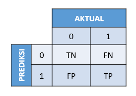

```{r setup, include=FALSE}
# clear-up the environment
rm(list = ls())

# chunk options
knitr::opts_chunk$set(
  message = FALSE,
  warning = FALSE,
  fig.align = "center",
  comment = "#>")
options(scipen = 9999)

# library
library(dplyr)
```

Klasifikasi bertujuan untuk memprediksi kelas (**target variable kategorik**):

* binary classification: 2 kelas
* multiclass classification: > 2 kelas

# Logistic Regression

## Basic Intuition

### Probability

Pada dasarnya, ketika kita melakukan klasifikasi, kita menghitung **peluang**. 

**Contoh:**

Anda adalah student Algoritma yang akan mengerjakan kuis C1. Pada batch sebelumnya, ada 24 dari 30 student yang berhasil mengerjakan kuis. Apakah Anda akan lulus pada kuis C1 ini?

```{r}
# peluang

24/30

```
```{r}
# peluang tidak lulus

1- 0.8

```
```{r}
# tentukan kelas

peluang <- 4/30

ifelse(peluang > 0.5 , yes = "lulus", no = "tidak lulus")

```

Berapa range peluang?

* min: 0
* max: 1

Berapa range hasil prediksi model regresi?

* min: -inf
* max: inf

Dibutuhkan suatu jembatan agar regression dapat digunakan untuk memprediksi peluang. Jembatan itu adalah **Odds** dan **Log of Odds**.

### Odds & Log of Odds

Odds adalah bentuk lain dari peluang, yaitu perbandingan peluang antara **peluang kejadian terjadi/peluang kejadian tidak terjadi**.  

$$\frac{p}{(1-p)}$$ 

`p` = peluang suatu kejadian terjadi

**Contoh 1:**

Berapa odds dari Anda lulus mengerjakan kuis C1?

```{r}
# peluang = 0.8
# peluang tidak lulus = 0.2
# odds
0.2/0.8
```

Interpretasi: Kejadian seseorang lulus kuis adalah **4 KALI lebih mungkin** dibandingkan tidak lulus kuis. 

Dapat dianalogikan juga, bila odds = 4 (4:1), maka bila ada 4 orang lulus ada yang 1 tidak lulus.

**Contoh 2:** 

Anda hendak berpergian menggunakan pesawat dari Soekarno Hatta Airport. Bila diketahui dari 100 penerbangan di Soekarno Hatta, terdapat 25 pesawat `Delay`. Berapa odds pesawat Anda `On Time`?

```{r}
# peluang
p <- 75/100
# odds
p/(1-p)
```

Interpretasi:

* kemungkinan pesawat on time 3 kali lebih mungkin

Note: Kalau oddsnya 1 berarti peluangnya? 0.5

Berapa range nilai dari odds? 

```{r}
# odds: p/1-p
# min
0/(1-0)
# max
1/(1-1)
```

* Probability: 0 1
* Odds       : 0 Inf

Log of odds adalah nilai odds yang dilogaritmikkan:

\(logit(p) = log(\frac{p}{1-p})\)

```{r}
# log of odds - lulus kuis
log(4)
# log of odds - pesawat on time
log(3)
```

Berapa range nilai log of odds?

```{r}
# min
log(0/(1-0))
# max
log(1/(1-1))
```

* Probability: 0 1
* Odds       : 0 inf
* Log of odds: -inf inf

Odds dan log of odds mampu menjembatani antara nilai yang dihasilkan oleh model regresi, ke rentang nilai peluang. **Logistic regression menghasilkan Log of Odds**. Nilai log of odds dapat dikembalikan ke bentuk odds (untuk diinterpretasikan) dan peluang sehingga dapat digunakan untuk klasifikasi.

```{r}
# log of odds -> odds
odds <- exp(1.386294)
odds
```

```{r}
# odds -> peluang dengan `odds/(odds+1)`
odds/(odds+1)
```

Terdapat cara lain:

* `logit()`: peluang -> log of odds
* `inv.logit()`: log of odds -> peluang

```{r}
library(gtools)

# peluang -> log of odds dengan `logit()`
logit(0.8)
```

```{r}
# log of odds -> peluang dengan `inv.logit()`
inv.logit(1.386294)
```

Fungsi `inv.logit()` ini juga biasa disebut *sigmoid function*.

```{r}
# sigmoid function
curve(inv.logit(x), from = -10, to=10, 
      xlab = "Log of Odds", 
      ylab = "Peluang")
```

## `glm()` & Interpretation

Anda adalah seorang analis performa student di universitas. Anda ditugaskan untuk memprediksi status kelulusan siswa dengan honors (cumlaude).

```{r}
# read & inspect data
honors <- read.csv("data_input/sample.csv") %>% 
  select(-femalexmath)

glimpse(honors)
```

Deskripsi kolom:

* `female`: gender of student (1 for female)
* `read`: score in reading test
* `write`: score in writing test
* `math`: score in math test
* `hon`: status of graduating in honors (1 for honors)

```{r}
# cek missing value
anyNA(honors)
```

```{r}
# data wrangling
honors <- honors %>% 
  mutate(female = as.factor(female),
         hon = as.factor(hon))
```

Cara membuat model logistic regression:

`glm(target ~ prediktor, data, family = "binomial")`

### Tanpa Prediktor

```{r}
honors.logit <- glm(formula = hon ~ 1, data = honors, family = "binomial")

summary(honors.logit)
```

**Intercept**: log of odds dari target (student mendapatkan honors (1))

Berikut pembuktiannya:

```{r}
# peluang
table(honors$hon)
```

```{r}
# log of odds student honors
logit(49/200)
```

**Interpretasi**: Log of odds tidak dapat diinterpretasikan. Untuk interpretasi, nilai log of odds kita ubah ke odds.

```{r}
# log of odds -> odds
exp(-1.12546)
```

> berarti kemungkinan calon siswa mendapatkan honors 0.32 kali lebih mungkin dari pada tidak mendapatkan honors

> kemungkinan calon siswa lebih kecil mendapatkan honor dari pada tidak mendapatkan honors

### 1 Prediktor Kategorik

Buat model untuk memprediksi `honors` berdasarkan gender `female`:

```{r}
honors.logit2 <- glm(formula = hon ~ female  , data = honors , family = "binomial")

summary(honors.logit2)
```

**Female**: log of *odds ratio* dari student female mendapatkan honors dibandingkan student male mendapatkan honors.

```{r}
# proportion
table(female = honors$female, honors = honors$hon)
```

```{r}
# peluang
p_female <- 32/(32+77)
p_male <- 17/91

# odds 
o_female <- p_female / (1-p_female)
o_male <- p_male / (1-p_male)

# log of odds
log(o_female/o_male) 
# log dari odds female mendapakan honors dibagi dengan log dari odd male mendapakan honors
```

log dari odds fema

**Intercept**: log of odds dari student male yang mendapatkan honors (basis)

```{r}
log(o_male)
```

**Interpretasi:**

```{r}
# odds female dapat honors
exp(0.5927822)

```

> kemungkinan perempuan mendapatkan honors 1.8 kali lebih mungkin dari pada pria mendapatkan honors

> ...

### 1 Prediktor Numerik

Buat model untuk memprediksi `honors` berdasarkan nilai `math`:

```{r}
honors.logit3 <- glm(formula = hon ~ math, data = honors, family = "binomial")

summary(honors.logit3)
```

**Intercept**: ...

**Math**: ...

Contoh: 

`hon = -9.79394 + 0.15634 * math`

Student A memiliki nilai math 52, student B 53. Hitung masing-masing log of oddsnya, berapa selisihnya?

```{r}
# hint: substitusi formula model saja
# log of odds
hon52 <-  -9.79394 + 0.15634 * 52
hon53 <- -9.79394 + 0.15634 * 53

hon53-hon52
```

**Interpretasi:**

```{r}
# log of odds -> odds

exp(hon53-hon52)
```

> dengan menigkatnya 1 point dari nilai matematika maka siswa 1.17 kali lebih mungkin mendapatkan honors 

>

>

### Banyak Prediktor

Buat model untuk memprediksi `honors` berdasarkan  gender `female` dan nilai `math`:

```{r}
honors.logit4 <- glm(hon ~ female + math, data = honors , family= "binomial")


summary(honors.logit4)
```

**Interpretasi koefisien:**

cari odds dari masing masing predictor:

```{r}
# female
exp(0.96531 )

# math
exp(0.16422)
```

`female` = 2.625601

> kemungkinan female mendapatkan honors 2.63 kali lebih mungkin dari pada pria mendapatkan honors **ketika nilai matematikanya sama/konstan**

`math` = 1.178474

> setiap pengingkatan 1 point pada matematika mengakibatkan 1.18 kali lebih mungkin mendapatkan honors **ketika variable lainnya konstan**

> jika seorang siswa memiliki nilai 1 point lebih tinggi nilai matematikanya dari siswa lainnya maka dia akan 1.18 kali lebih mungkin mendapatkan honors ketika varible lainnya konstan

**Aplikasi:**

Final formula: ...

1. Joe adalah seorang male yang nilai math-nya 60, berapa peluang dia mendapatkan honors? Apakah dia akan lulus dengan honors?

```{r}

```

```{r}

```

2. Wulan adalah seorang female dan nilai math-nya 80, berapa peluang dia mendapatkan honors? Apakah dia akan lulus dengan honors?

```{r}

```

```{r}

```

Bonus! Apa yang harus dilakukan Husain agar ia dapat lulus dengan predikat honors? ...

```{r}

```

**Summary:**

1. Logistic regression menghasilkan log of odds
  - fungsi: ...

2. Untuk interpretasi model logistic regression,

- dilakukan: ...
- menggunakan fungsi: ...

Interpretasi koefisien dapat dilakukan dan berbeda untuk masing-masing kondisi: 

- tanpa prediktor
- 1 prediktor kategorik
- 1 prediktor numerik
- banyak prediktor

Bila koefisien variable:

- positif: ...
- negatif: ...

3. Untuk menentukan kelas (klasifikasi) dari hasil logistic regression, nilai ... diubah kebentuk ... kemudian ditentukan kelasnya berdasarkan batas tertentu (misal = 0.5).

___end of day 1___ 

### Perfect Separation

* **Null deviance**: deviasi model saat tanpa prediktor (model terburuk).
* **Residual deviance**: deviasi model saat menggunakan prediktor.

Umumnya semakin banyak prediktor maka residual deviance akan semakin kecil.
```{r}
summary(honors.logit)
```


```{r}
# null deviance
honors.logit$null.deviance
```

```{r}
# residual deviance
honors.logit$deviance # wo/ predictor
honors.logit2$deviance # w/ female
honors.logit3$deviance # w/ math
honors.logit4$deviance # w/ female + math
```

Mari buat model `honors.logit5` untuk memprediksi `honors` berdasarkan semua prediktor yang ada:

```{r message=TRUE, warning=TRUE}
honors.logit5 <- glm(hon ~ . , data = honors, family = "binomial")
summary(honors.logit5)
```

NOTE: 

* *glm.fit: fitted probabilities numerically 0 or 1 occurred* -> warning bahwa bisa dihasilkan probability yang tepat 1 atau 0 (indikasi kondisi **perfect separation**)
* *glm.fit: algorithm did not converge* -> warning bahwa algoritmanya tidak mencapai kondisi stabil hingga iterasi ke-25 (default), dapat terjadi salah satunya karena kondisi **perfect separation**.

**Perfect Separation** adalah sebuah kondisi dimana ada 1 variabel yang dapat memisahkan kelas target secara sempurna. Cara mendeteksi:

* Lihat dari estimate, kalau ada yang paling beda 
* p value, kalau p value terlalu banyak yang tidak signifikan 
* null dan residual deviance. 
* iteration lebih dari 25

```{r}
# log of odds -> odds
exp(honors.logit5$coefficients)
```

Pada kasus ini, nilai write dapat memisahkan kelas honor dengan sempurna:

```{r}
table(honors$hon, honors$write)
```

```{r}
plot(honors$hon, honors$write)
```

> Tidak disarankan menggunakan model dengan perfect separation, karena model amat bias pada salah satu variable dan tidak mempertimbangkan variable lain. Hal ini dapat membuat model tidak akurat (buruk) dalam memprediksi ke data baru.

Apa yang kita lakukan bila bertemu kondisi perfect separation:

* kalau kasus seperti ini kita terima, tidak usah membuat machine learning, cukup `ifelse` saja.
* kalau kasus ini tidak kita terima, maka jangan gunakan variabel ini sebagai prediktor.
* observasi (data) nya kita tambah

```{r}
# revisi model
honors.logit6 <- glm(hon ~ female + read + math , data = honors, family = "binomial")
summary(honors.logit6)
```

### AIC

AIC = Jumlah informasi yang hilang. Semakin kecil AIC, semakin baik model.

```{r}
honors.logit$aic # wo/ predictor
honors.logit2$aic # w/ female
honors.logit3$aic # w/ math
honors.logit4$aic # w/ female + math
honors.logit6$aic # w/ all predictor except write
```

```{r}
honors.logit5$aic # w/ write 
```

**Important Notes:**

Dalam menseleksi model, model yang baik adalah:

* model dengan nilai AIC rendah
* model tanpa kondisi Perfect Separation

## Assumption

Logistic Regression menganut 3 asumsi:

* **Linearity of Predictor & Log of Odds**: cara interpretasi model mengacu pada asumsi ini (contoh: untuk variabel numerik, peningkatan 1 nilai akan meningkatkan log of odds)
* **Multicollinearity**: antar prediktor tidak saling berkorelasi kuat (hingga nilai 1 / -1) -> uji `vif()`
* **Independence of Observations**: antar observasi saling independen & tidak berasal dari pengukuran berulang (repeated measurement) -> kita harus ambil data secara random sampling

Asumsi logistic regression menuntut kita untuk memahami data secara mendalam dan memastikan data sudah siap dipakai untuk membuat model. Coba analisis kasus di bawah:

**Dive Deeper**

Berikut data penerbangan pesawat dalam `flight_sm.csv`:

```{r}
flight <- read.csv("data_input/flight_sm.csv") %>% 
  mutate(DepDel15 = as.factor(DepDel15)) %>% 
  mutate_at(.vars=c('DayofWeek', 'Month'),
            .funs = as.factor)
glimpse(flight)
```

Dekspripsi kolom:

* `Year, Month, DayofMonth, DayofWeek`: self-explanatory
* `Carrier`: maskapai
* `CRSDepTime & CRSArrTime`: jadwal departure & arrival (hhmm)
* `DepDel15`: status delay (1 = delay)
* `OriginState, DestState`: lokasi keberangkatan & tujuan

Buat model `flight.model` untuk memprediksi `DepDel15` berdasarkan `Month` + `DayofWeek`, kemudian tampilkan summary-nya:

```{r}
flight.model <- glm(DepDel15~Month + DayofWeek, flight, family='binomial')
summary(flight.model)
table(flight$Month, flight$DepDel15)
```
```{r}
exp(flight.model$coefficients) # qna
```


# Classification Workflow

1. Business Question
2. Read Data
3. Data Wrangling
4. EDA  (untuk logistic regression selesaikan pengecekan asumsi disini)
5. Cross Validation
6. Data Pre-Processing
7. Build Model
8. Predict
9. Model Evaluation
10. Model Tuning -> Final Model

**Studi Kasus: Credit Risk Analysis**

Buat model untuk memprediksi peluang customer akan gagal bayar pinjaman (loan default), untuk mengindikasikan apakah customer tersebut baik atau tidak untuk diberikan pinjaman.

### Read Data

```{r}
loans <- read.csv("data_input/loan2017Q4.csv", stringsAsFactors = T)
```

### Data Wrangling

```{r}
glimpse(loans)
```

Target: not_paid (paid = 0, not_paid = 1)

Adakah variabel yang tipe datanya belum sesuai?

* grdCtoA
* not_paid
* delinq_2yrs

Adakah variabel yang dapat dibuang?

* verivied 
* grade 
* annual_inc

```{r}
library(dplyr)
loans_clean <- loans %>% 
  mutate_at(.vars=c("verified","grdCtoA","not_paid"), .funs = as.factor) %>% 
  select(-annual_inc, -grade, -verification_status)
```

### Exploratory Data Analysis

**Cek missing value**

```{r}
anyNA(loans_clean)
```
**Cek Duplicate**
```{r}
sum(duplicated(loans_clean)) 
```
*** cara buang outlier = 2*IQR ***

**Cek persebaran/pattern data**

```{r}
# explore with summary
summary(loans_clean)
```

Insight: 
- 

Literature: Higher debt-to-income ratio (dti) and amount of credit card debts are both associated with a greater likelihood of loan defaults.

```{r}
# numeric predictor vs target variable
boxplot(loans_clean$not_paid, loans_clean$dti, ylim=c(0,50))
```

```{r}
table(loans_clean$purpose, loans_clean$not_paid)
```


Insight: 

**Cek class-imbalance** 

```{r}
prop.table(table(loans_clean$not_paid))
```

Proporsi yang seimbang penting agar model dapat mempelajari karakteristik kelas positif maupun negatif secara seimbang, tidak belajar dari satu kelas saja. Hal ini mencegah model dari *hanya baik memprediksi 1 kelas saja*. 

Proporsi yang imbalance umumnya 90/10 atau 95/5.

Kalau datanya imbalance:

- tambah data
- downSampling -> buang observasi dari kelas mayoritas, sehingga seimbang
- upSampling -> duplicate observasi dari kelas minoritas, sehingga seimbang
cara upsampling dengan ***SMOTE***
akan dipelajari di C2

### Cross Validation

- split data menjadi 2 bagian yaitu **data train** dan **data test**. 
- data train akan digunakan untuk training model.
- data test akan digunakan untuk pengujian performa model. model akan diuji untuk memprediksi data test. hasil prediksi dan data aktual dari data test akan dibandingkan untuk validasi performa model.

Analogi:

* 100 soal
* 80 soal saya pakai untuk belajar (data train)
* 20 soal saya pakai untuk ujian (data test)

tujuan dari cross validation adalah untuk mengetahui seberapa baik model yg sudah kita buat.

```{r}
# # intuisi set seed: mengunci random number kita
# set.seed(417) # pakai set.seed -> random number dikunci, hasil sampling selalu sama
# sample(c("Angela", "Anthony", "Rizky", "Kevin"), 2)
```

```{r}
RNGkind(sample.kind = "Rounding") # tambahan khusus u/ R 3.6 ke atas 
set.seed(417) # mengunci random number yang dipilih

# index sampling


# splitting
loans.train <- 
loans.test <- 
```

NOTE: Proporsi 0.8/0.2 tidak mutlak, tergantung kebutuhan kita. Umumnya yang lebih banyak adalah untuk data train.

```{r}
# re-check class imbalance

```

proporsi kelas yang balance penting untuk data train karena kita akan melatih model menggunakan data train.

### Build Model

Buatlah model logistic regression untuk memprediksi status loan (not_paid). Silahkan lakukan feature selection berdasarkan pertimbangan bisnis atau/dan statistik!

```{r}
model.loans <- 
  
```

```{r}

```

Pilih masing-masing 1 untuk prediktor kategorik dan prediktor numerik, kemudian interpretasikan:

```{r}
# numerik:


# kategorik:

```

> ...

> ...

### Predict

`predict(model, newdata, type)`

pada `type` terdapat pilihan:

* link: menghasilkan log of odds
* response: menghasilkan peluang

Prediksi log of odds `not_paid` untuk 6 data teratas:

```{r}
predict(object = ... , 
        newdata = loans.test[1:6,], 
        type = "link")
```

Prediksi probability `not_paid` untuk 6 data teratas:

```{r}
predict(object = ... , 
        newdata = loans.test[1:6,], 
        type = "response")
```

**Dive Deeper**

Lakukan prediksi probability `not_paid` untuk data loans.test dan disimpan pada kolom baru bernama `pred.Risk`.

```{r}

```

Klasifikasikan data loans.test berdasarkan `pred.Risk` dan simpan pada kolom baru bernama `pred.Label`.

```{r}
# ifelse(kondisi, benar, salah)

# pastikan kelas target (aktual dan prediksi) bertipe factor

```

**Note:**

Penentuan label yang menjadi angka 1 pada **model logistic regression** adalah berdasarkan levels.

kelas "0", "1" -> basis = 0, 
                  peluang mendekati 0 -> 0
                  peluang mendekati 1 -> 1

kelas "honors" "non-honors" -> basis = honors
                            peluang mendekati 0 -> honors
                            peluang mendekati 1 -> non-honors

```{r}
# lihat hasil prediksi
loans.test %>% 
  select(not_paid, pred.Risk, pred.Label) %>% 
  head(6)
```

**Summary**

1. Seleksi model logistic regression:

- AIC 
- Perfect separator

2. Asumsi model logistic regression:

- linearity  logit
- multicol
- independence 

3. Workflow klasifikasi:
 
* ...
* ...
* ...

### Build Model 

Buatlah model logistic regression untuk memprediksi status loan (not_paid). Silahkan lakukan feature selection berdasarkan pertimbangan bisnis atau/dan statistik!

```{r}
model.loans <- 
```

```{r}

```

Pilih masing-masing 1 untuk prediktor kategorik dan prediktor numerik, kemudian interpretasikan:

```{r}
# numerik:


# kategorik:

```

> ...

> ...

### Predict

`predict(model, newdata, type)`

pada `type` terdapat pilihan:

* link: menghasilkan log of odds
* response: menghasilkan peluang

Contoh: prediksi probability `not_paid` untuk 6 data teratas:

```{r}
predict(object = model.loans, 
        newdata = loans.test[1:6,], 
        type = "response")
```

**Dive Deeper**

Lakukan prediksi probability `not_paid` untuk data loans.test dan disimpan pada kolom baru bernama `pred.Risk`.

```{r}

```

Klasifikasikan data loans.test berdasarkan `pred.Risk` dan simpan pada kolom baru bernama `pred.Label`.

```{r}
# ifelse(kondisi, benar, salah)

# pastikan kelas target (aktual dan prediksi) bertipe factor

```

**Note:**

Penentuan label yang menjadi angka 1 pada **model logistic regression** adalah berdasarkan levels.

kelas "0", "1" -> basis = 0, 
                  peluang mendekati 0 -> 0
                  peluang mendekati 1 -> 1

kelas "honors" "non-honors" -> basis = honors
                            peluang mendekati 0 -> honors
                            peluang mendekati 1 -> non-honors

```{r}
# lihat hasil prediksi
loans.test %>% 
  select(not_paid, pred.Risk, pred.Label) %>% 
  head(6)
```

### Model Evaluation

Setelah dilakukan prediksi menggunakan model, masih ada saja prediksi yang salah. Pada klasifikasi, kita mengevaluasi model berdasarkan **confusion matrix**:

* true positive (TP): prediksi positif; aktual positif
* true negative (TN): prediksi negatif; aktual negatif 
* false positive (FP): prediksi positif; aktual negatif
* false negative (FN): prediksi negatif; aktual positif

```{r, out.width = "40%", echo = FALSE, fig.align = "center"}

```

```{r}
library(caret)

```

4 metrics performa model: Accuracy, Sensitivity/Recall, Precision, Specificity 

**Accuracy**

Seberapa banyak yang benar diprediksi dari keseluruhan data (positif maupun negatif).

`TP+TN/TOTAL`

```{r}

```

Digunakan ketika:

- kelas target sama penting
- data balance

Ada kondisi ketika accuracy bukanlah metrics terpenting. Umumnya ketika:

- kita mementingkan salah satu kelas (misal, kelas positif)
- data kita imbalance

Saat kita mementingkan kelas tertentu (kelas positif), maka kita dapat memilih antara menggunakan metrics Recall / Precision: 

**Sensitivity/Recall**

Seberapa banyak yang **benar diprediksi positif**, dari yang **re**ality-nya (aktualnya) positif.

`TP/(TP+FN)`

```{r}

```

**Pos Pred Value/Precision**

Seberapa banyak yang **benar diprediksi positif**, dari yang di**pre**diksi positif. 

`TP/(TP+FP)`

```{r}

```

Untuk memahaminya mari berdiskusi:

**Diskusi**

ROLE PLAY:

1. Seorang dokter ingin mendiagnosa pasien kanker menggunakan model machine learning. Pasien yang kanker akan diarahkan untuk pemeriksaan lanjutan. Untuk melihat kebaikan model, metrics mana yang lebih kita utamakan? 

* Target variabel = kanker/non-kanker
* Kelas positif = kanker
* Metrics = ...

2. Kita ingin membuat model prediksi untuk mengklasifikasikan e-mail spam/ham. Metrics mana yang lebih kita utamakan?
  
* Target variabel = spam/ham
* Kelas positif = spam
* Metrics = ...

3. Bila ada seorang **seller** dan **bos**nya yang hendak menawarkan produk perusahaan ke 1000 calon pelanggan. Ingin dibuat model prediksi dimana positive = pelanggan membeli produk. Maka siapa yang mementingkan recall, siapa yang mementingkan precision, dan mengapa?

**Bos**: ..., karena ...

**Seller**: ..., karena ...

**Specificity**

Seberapa banyak yang **tepat diprediksi negatif**, dari yang **reality-nya negatif**. Jarang dipakai karena kita tidak sering fokus pada kelas negatif.

`TN/(TN+FP)`

```{r}
93/(93+68)
```

4. Metrics yang baik untuk kasus loans adalah? (positif: not paid) 

 ...

Bila hasil evaluasi (nilai metrics) belum memuaskan, dapat dilakukan **Model Tuning**:

1. ganti prediktor
2. ubah data pre-processingnya: misal upsample/downsample, scaling dll.
3. ganti modelnya (pakai model yang lebih robust)
4. ganti treshold prediction (tidak terlalu dianjurkan, karena bisa memaksakan):
  * geser mendekati 0: meningkatkan recall
  * geser mendekati 1: meningkatkan precision

```{r}
# label baru dari threshold baru
loans.test$pred.Label <- ...

# confusion matrix

```


