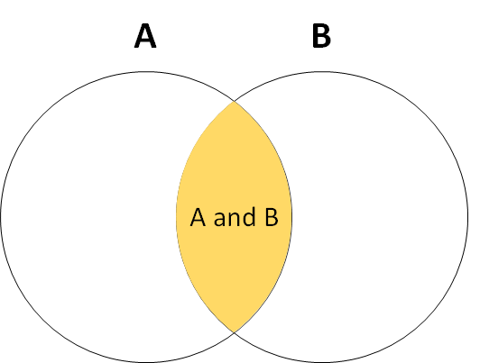
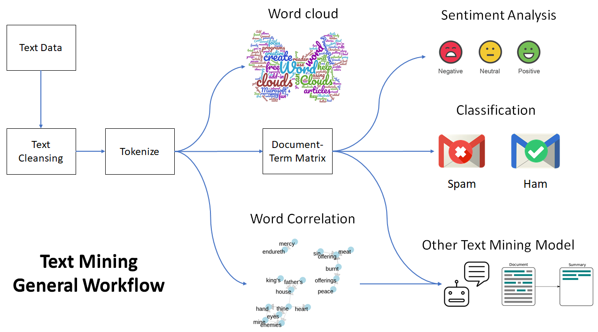
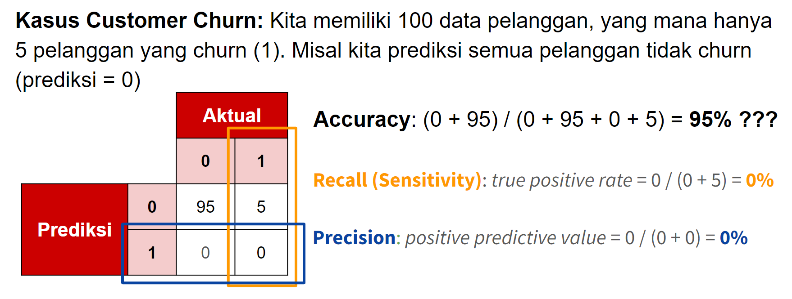
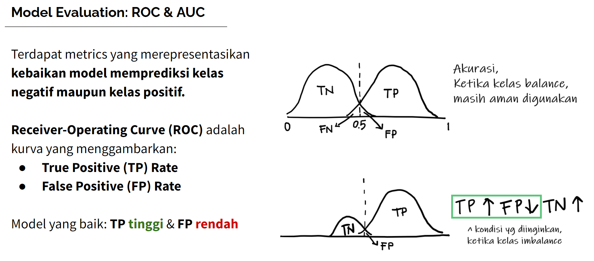
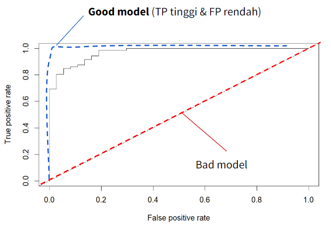
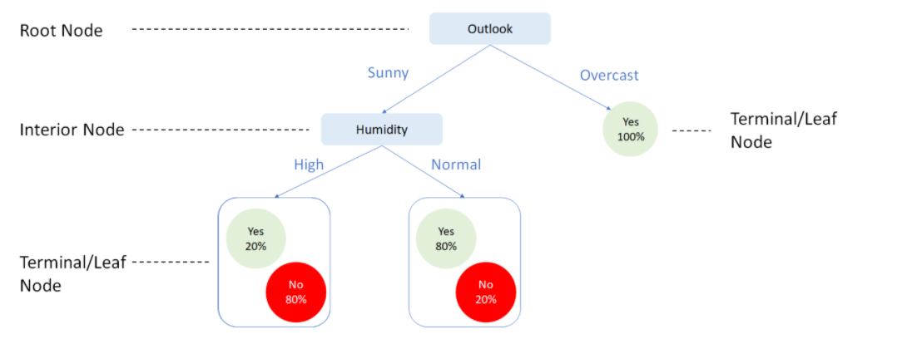
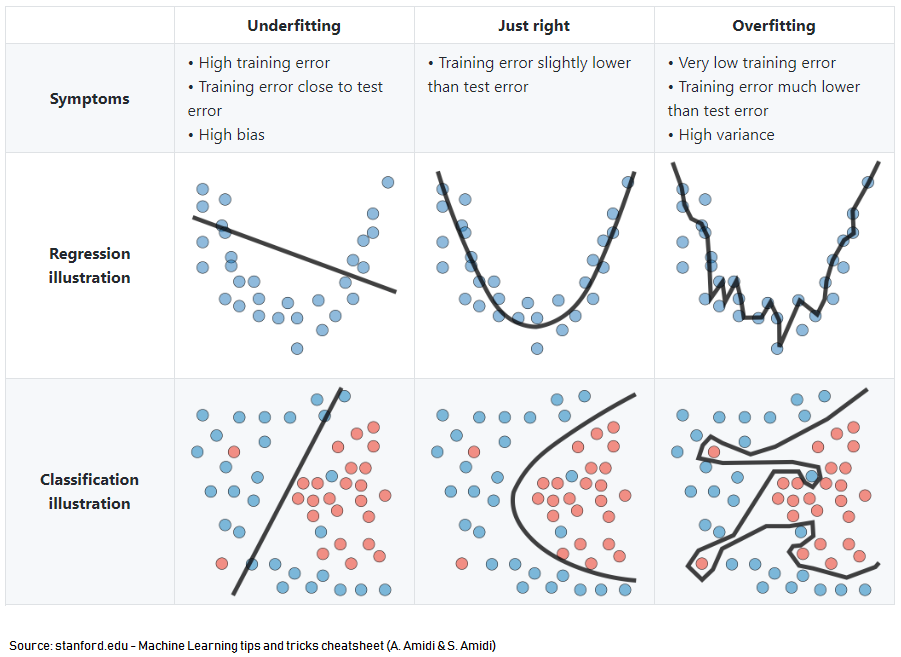
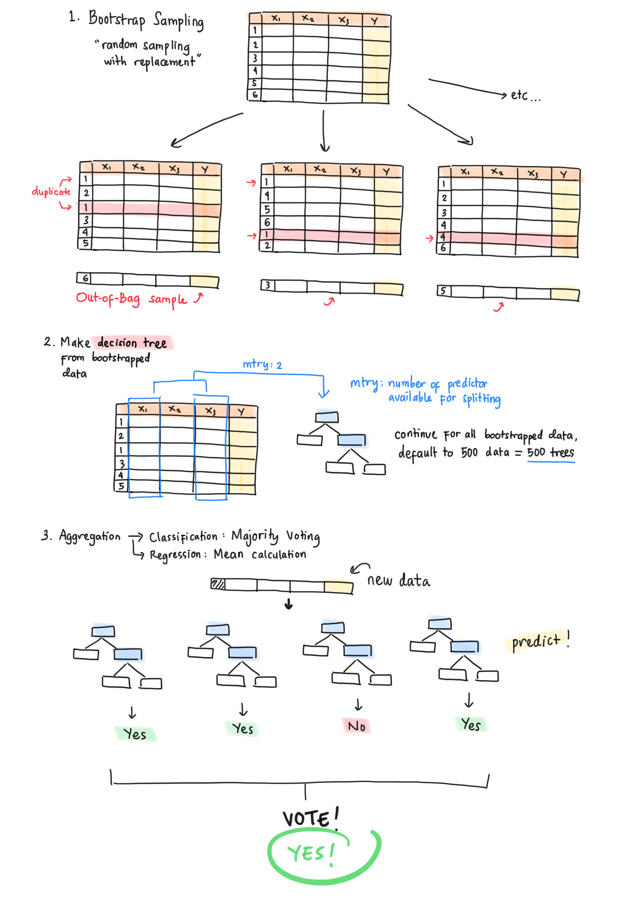
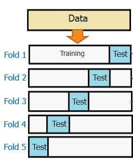

```{r setup, include=FALSE}
# clear-up the environment
rm(list = ls())

# chunk options
knitr::opts_chunk$set(
  message = FALSE,
  warning = FALSE,
  fig.align = "center",
  comment = "#>"
)
options(scipen = 9999)
```

# Naive Bayes Classifier

## Concept: Bayes Theorem

Naive Bayes didasari oleh **Bayes' Theorem of Probability**. Bayes Theorem membahas terkait **peluang kejadian dependen** (dependent events)

- *Kejadian Independen* (saling bebas/tdk mempengaruhi)
  a. Kemungkinan hujan hari ini, dengan kemungkinan nasabah mengambil kredit 
  b. Kejadian saya makan siang dengan nasi padang, dengan Indonesia menang Thomas Cup

- *Kejadian Dependen* (saling mempengaruhi)
  a. Kemungkinan memenangkan Thomas cup jika diketahui keadaan stamina atlet 
  b. Kemungkinan banjir di Jakarta jika diketahui adanya hujan deras di Bogor

### Kejadi Independent

```{r echo=FALSE, out.width="80%"}

```

> Kejadian A **dan** kejadian B terjadi bersamaan

$$P(A \cap B) = P(A) \times P(B)$$

*Contoh Kasus:* Cobalah hitung peluan dadu muncul angka 4 pada lemparan pertama **dan** peluang menucul angka 6 pada lemparan kedua?

- *Perhitungan Event A:* Peluang dadu muncul angka 4 pada lemparan pertama $P(A) = 1/6$
- *Perhitungan Event B:* Peluang dadu muncul angka 6 pada lemparan kedua $P(B) = 1/6$

$$P(A \cap B) = P(A) \times P(B) = \frac{1}{6} \times \frac{1}{6} = \frac{1}{36}$$
> Maka, peluang dadu muncul angka 4 pada lemparan pertama dan dadu muncul angka 6 pada lemparan kedua adalah 1/36.

### Dependent Event

```{r echo=FALSE, out.width="80%"}
knitr::include_graphics("assets/venn.gif")
```

> Kejadian A terjadi **jika diketahui** kejadian B telah terjadi a.k.a peluang bersyarat. Peluang A Bersyarat B.

Untuk menghitung peluang kejadian A, perlu menggunakan **Bayes Theorem**:

$$P(A|B) = \frac{P(B|A) P(A)}{P(B|A) P(A)\ +\  P(B|\neg A) P(\neg A)}$$

Atau

$$P(A|B) = \frac{P(A \cap B) P(A)}{P(B \cap A) P(A)\ +\  P(B \cap A | \neg A) P(\neg A)}$$

Keterangan:

- $P(A|B)$ / $P(A \cap B)$ = Peluang terjadi A jika diketahui B **telah terjadi**
- $P(A)$ = Peluang terjadi A 
- $P(B|A)$ / $P(B \cap A)$ = Peluang terjadi B jika diketahui A telah terjadi
- Simbol $\neg$ (negasi) menandakan kejadian tersebut **tidak** terjadi.

## Warm Up Case: Market Analysis

Sebagai seorang marketing analyst, kita ingin meningkatkan penjualan dengan menargetkan customer dengan karakteristik tertentu. Dari data historis **400 customer** yang sudah diprospek, kita peroleh informasi tentang `gender`, `umur`, dan `kategori gaji` serta apakah `dia membeli produk kita atau tidak`. 

```{r}
# Please run the code down below
library(dplyr)

cust_behaviour <- read.csv("data_input/Customer_Behaviour.csv", 
                           stringsAsFactors = T)

glimpse(cust_behaviour)
```

Deskripsi data:

- `Gender`: Jenis Kelamin (Male, Female)
- `Age`: Range usia (< 30, 30-50, > 50)
- `Salary`: Kategori Gaji Customer (Low, Medium, High)
- `Purchased`: Apakah klien membeli produk kita atau tidak (Yes, No)

*Pertanyaan*: 

Jika ada seorang **customer perempuan** dengan nama Diva, yang **usianya masih di bawah 30 tahun** dan memiliki **kategori gaji yang tinggi**. Berapakan peluang Diva membeli produk?

### Asumsi Naive Bayes

Naive Bayes memanfaatkan kejadian dependent events, namun menerapkan asumsi *Naive* pada hubungan antar prediktornya:

1. Hubungan prediktor dengan target variabel saling dependen 
2. Hubungan antar prediktor saling independen: 

Saat prediktor berupa kata *"Gender", "Age", "Salary"*, kemunculan masing-masing kata dianggap kejadian independen. Sehingga dapat dituliskan seperti di bawah ini:

Untuk mempersingkat notasi, kita simbolkan kejadian $A, B, C$ (prediktornya) sebagai:

- $A$: Gender = Female
- $B$: Age < 30
- $C$: Salary = High

$$P(A\ \cap\ B\ \cap\ C\ |\ Purchase) = P(A\ |\ Purchase) \times P(B\ |\ Purchase) \times P(C\ |\ Purchase)$$

$$P(A\ \cap\ B\ \cap\ C\ |\ \neg Purchase) = P(A\ |\ \neg Purchase) \times P(B\ |\ \neg Purchase) \times P(C\ |\ \neg Purchase)$$

Sehingga:

$$P(Purchase| A\ \cap\ B\ \cap\ C) = \frac{P(Purchase) \ P(A\ |\ Purchase)\ P(B\ |\ Purchase)\ P(C\ |\ Purchase)}{P(Purchase) \ P(A\ |\ Purchase)\ P(B\ |\ Purchase)\ P(C\ |\ Purchase)\ +\ P(\neg Purchase) \ P(A\ |\neg Purchase)\ P(B\ |\neg Purchase)\ P(C\ |\neg Purchase)}$$

### Perhitungan manual

Mari kita cari satu per satu peluang yang dibutuhkan:

1. Peluang seorang cutomer membeli $P(Purchase)$ dan Peluan seorang cutomer tidak membeli $P(\neg Purchase)$

- Tabel Frekuensi Customer Membeli & Tidak membeli

```{r}
# Proporsi customer membeli dan tidak membeli
prop.table(table(cust_behaviour$Purchased))
```

- Perhitungan Peluang

```{r}
# Peluang Customer Membeli
p_purchase <- 0.3575
# Peluang Customer Tidak Membeli
p_not_purchase <- 0.6425
```

2. Peluang seorang cutomer gender female membeli $P(A\ |\ Purchase)$ dan Peluang seorang cutomer gender female tidak membeli $P(A\ |\neg Purchase)$

- Tabel Frekuensi Gender Membeli & Tidak membeli

```{r}
# Please run the code down below
table(cust_behaviour$Gender, cust_behaviour$Purchased)
```

- Perhitungan peluang customer ber-Gender *Female* diketahui dia *membeli* produk.

 $P(A\ |\ Purchase)$

```{r}
# Please type your code down below
p_female_purchase <- 77 / (77 +66)
```

- Perhitungan peluang customer ber-Gender *Female* diketahui dia *tidak membeli* produk.

$P(A\ |\neg Purchase)$

```{r}
# Please type your code down below
p_female_not_purchase <- 127 / (127 + 130)
```

3. Peluang seorang cutomer dengan umur < 30 tahun membeli $P(B\ |\ Purchase)$ dan Peluang seorang cutomer dengan umur < 30 tahun tidak membeli $P(B\ |\neg Purchase)$

- Tabel Frekuensi customer dengan umur < 30 tahun Membeli & Tidak membeli

```{r}
# Please run the code down below
table(cust_behaviour$Age, cust_behaviour$Purchased)
```

- Perhitungan peluang customer dengan *umur < 30 tahun* diketahui dia *membeli* produk.

$P(B\ |\ Purchase)$

```{r}
# Please type your code down below
p_age30_purchase <-  4 / (4 + 95 + 94)
```

- Perhitungan peluang customer dengan *umur < 30 tahun* diketahui dia *tidak membeli* produk.

$P(B\ |\neg Purchase)$

```{r}
# Please type your code down below
p_age30_not_purchase <- 96 / (96 + 4 + 157)
```

4. Peluang seorang cutomer dengan salary high membeli $P(C\ |\ Purchase)$ dan Peluang seorang cutomer dengan salary high tidak membeli $P(C\ |\neg Purchase)$

- Tabel Frekuensi customer dengan salary high Membeli & Tidak membeli

```{r}
# Please run the code down below
table(cust_behaviour$Purchased, cust_behaviour$Salary)
```

- Perhitungan peluang customer dengan *salary high* diketahui dia *membeli* produk.

$P(C\ |\ Purchase)$

```{r}
# Please type your code down below
p_high_purchase <- 75 / (75+ 39 + 29)
```

- Perhitungan peluang customer dengan *salary high* diketahui dia *tidak membeli* produk.

$P(C\ |\neg Purchase)$

```{r}
# Please type your code down below
p_high_not_purchase <- 19 / (19 + 56 + 182)
```

5. Terakhir, kita masukkan peluang yang telah dihitung ke dalam rumus:

$P(Purchase| A\ \cap\ B\ \cap\ C) = \frac{P(Purchase) \ P(A\ |\ Purchase)\ P(B\ |\ Purchase)\ P(C\ |\ Purchase)}{P(Purchase) \ P(A\ |\ Purchase)\ P(B\ |\ Purchase)\ P(C\ |\ Purchase)\ +\ P(\neg Purchase) \ P(A\ |\neg Purchase)\ P(B\ |\neg Purchase)\ P(C\ |\neg Purchase)}$

```{r}
# Please run the code down below
(p_purchase * p_female_purchase * p_age30_purchase * p_high_purchase) /
  (p_purchase * p_female_purchase * p_age30_purchase * p_high_purchase +
     p_not_purchase * p_female_not_purchase * p_age30_not_purchase * p_high_not_purchase)
```

### `naiveBayes()` function

Dengan menggunakan function `naiveBayes()` dari package `e1071`, kita tidak perlu melakukan perhitungan manual.

Terdapat 2 cara dalam membuat model menggunakan function `naiveBayes()` :

1. Menggunakan argumen `naiveBayes(formula, data)`

- `formula`: formula y~x, dimana y: target variabel, x: prediktor variabel
- `data`: data yang digunakan untuk target dan prediktor variabel

2. Menggunakan argumen `naiveBayes(x, y)`

- `x`: prediktor variabel dari data yang digunakan
- `y`: target variabel dari data yang digunakan

- *Pembuatan Model & Interpretasi*

```{r}
# Please type your code 

#install.packages("e1071")
library(e1071)
model_naive <- naiveBayes(formula = Purchased~., 
                          data = cust_behaviour)
```

Model Naive Bayes menyimpan informasi tentang nilai peluang dependen antara target dengan setiap feature dalam bentuk **prop.table()**. Kita bisa periksa nilainya dengan perhitungan manual:

```{r}
# Please run the code down below
model_naive
```

- *Prediksi*

Melalukan prediksi dengan function `predict()`

Syntax: `predict(object model, newdata, type)`

Terdapat parameter tambahan yang akan kita gunakan pada fungsi `predict()`, yaitu parameter `type`. Parameter `type` dapat kita isi dengan:

* `type = "raw"` mengembalikan nilai peluang untuk masing-masing kelas
* `type = "class"` mengembalikan label kelasnya (default threshold 0.5)

Contoh prediksi dengan menggunakan `type = raw`

Membuat dataframe untuk diprediksi

```{r}
# Please run the code down below
diva <- data.frame(Gender = "Female", 
                    Age = "< 30",
                    Salary = "High")
```

```{r}
# Please type your code down below
predict_result <- 
  predict(model_naive, newdata=diva, type='raw')
```
```{r}
ifelse(predict_result[,1] > 0.8, yes = 'No',no = 'Yes')
```


Contoh prediksi dengan menggunakan `type = class`

```{r}
# Please type your code down below
predict(model_naive, newdata=diva, type='class')
```

### Laplace Smoothing

Pada kasus tertentu, dapat terjadi data scarcity, yaitu kondisi dimana **suatu prediktor tidak hadir sama sekali di salah satu kelas**. Misalkan dari data `Customer_Behaviour` sebelumnya, pada customer yang melakukan **Purchase** sama sekali tidak ada yang ber-Gender Female, sehingga tabel frekuensinya menjadi sebagai berikut:

```{r echo=FALSE}
matrix(c(127, 130, 0, 143), nrow = 2, dimnames = list(c("Female", "Male"), c("No Purchase", "Purchase")))
```
  
Dari tabel di atas, kita peroleh: $P(Gender = Female\ |\ Purchase) = 0$. Apabila tabel frekuensi untuk prediktor lainnya tetap sama, maka peluang Tiara sebagai **Female** dengan **Age < 30** dengan **High Salary** untuk membeli produk adalah:

$$P(Purchase\ |\ Age <30 \ \cap\ Gender = Female\ \cap\ Salary = High ) \\
= \frac{\frac{143}{143+257}\ \frac{4}{4+45+94}\ \frac{0}{0+143}\ \frac{75}{75+39+29}}
{\frac{143}{143+257}\ \frac{4}{4+45+94}\ \frac{0}{0+143}\ \frac{75}{75+39+29} + \frac{257}{143+257}\ \frac{96}{96+4+157}\ \frac{127}{127+130}\ \frac{19}{19+56+182}} = 0$$

Ini adalah karakteristik kedua dari Naive Bayes: **Skewness Due To Scarcity**. Ketika terdapat *suatu prediktor yang frekuensi nilainya 0 untuk salah satu kelas* (pada kasus ini `Female` untuk `Purchase = Yes`), maka *model secara otomatis memprediksi bahwa peluangnya adalah 0 untuk kondisi tersebut, tanpa memperdulikan nilai dari prediktor yang lainnya*. Dengan kata lain, setiap ada customer ber-gender **Female** maka model kita akan langsung memprediksi dia sebagai tidak membeli. Model menjadi bias atau kurang akurat dalam melakukan prediksi.  
  
Berikut adalah solusinya:

- **Strategi 1: Menghilangkan prediktor yang bermasalah**

Prediktor yang bermasalah tidak digunakan untuk pembuatan model. Namun, cara ini mungkin kurang tepat kalau prediktor tersebut memang punya pengaruh besar terhadap hasil prediksi, sehingga ketika dihilangkan maka hasil prediksi justru kurang baik. Selain itu, dengan bertambahnya data, ada kemungkinan frekuensinya berubah dari yang sebelumnya tidak ada menjadi ada  
  
- **Strategi 2: Menggunakan Laplace Smoothing**

Kita ingin memastikan tidak ada observasi yang nol, namun juga proporsi tidak berubah jauh dari aslinya. Solusi alternatifnya menggunakan Laplace Smoothing, yaitu dengan cara **menambahkan frekuensi dari setiap prediktor sebanyak angka tertentu (biasanya 1)**, sehingga tidak ada lagi prediktor yang memiliki nilai 0.  
  
Contoh pada kasus di atas dengan menggunakan `laplace = 1`:

**Tabel Frekuensi Purchased (TETAP, karena bukan predictor)**

$$\begin {matrix} No & Yes \\\hline257 & 143\end{matrix}$$

**Tabel Frekuensi Gender**

$$\begin {matrix}& Female & Male \\\hline\neg Purchase & 127+1 & 130+1 \\Purchase & 0+1 & 143+1\end{matrix}$$

**Tabel Frekuensi Age**

$$\begin {matrix}& <30 & >50 & 30-50 \\\hline\neg Purchase & 96+1 & 4+1 & 157+1 \\Purchase & 4+1 & 45+1 & 94+1 \\\end{matrix}$$

**Tabel Frekuensi Salary**

$$\begin {matrix}& High & Low & Medium \\\hline\neg Purchase & 19+1 & 56+1 & 182+1 \\Purchase & 75+1 & 39+1 & 29+1 \\\end{matrix}$$

Jika kita hitung kembali, dengan laplace smoothing, peluang Tiara dalam membeli produk dari permasalahan data scarcity adalah:

```{r}
(143/(143+257) * 1/(1+144) * 5/(5+46+95) * 76/(76+40+30)) /
  (143/(143+257) * 1/(1+144) * 5/(5+46+95) * 76/(76+40+30) +
  257/(143+257) * 128/(128+131) * 97/(97+5+158) * 20/(20+57+183))
```

Walaupun peluangnya sangat kecil, tetapi setidaknya dengan metode Laplace Smoothing kita dapat memastikan model tidak terlalu ekstrim dalam mengklasifikasikan observasi serta tetap dapat mempertimbangkan nilai peluang dari prediktor lainnya.

Dengan menggunakan function `naiveBayes()`, kita cukup menambahkan parameter `laplace = 1`:

```{r}
# Please run the code down below

# Modeling
model_naive2 <- naiveBayes(formula = Purchased ~ . , 
                           data = cust_behaviour, 
                           laplace = 1)

# Predict
predict(model_naive2, newdata = diva, type = "raw")
```

Karakteristik Naive Bayes:

~ Asumsi:
  * Asumsi Naive:
    ~ antar prediktor independent
    ~ antar prediktor memiliki bobot yang sama untuk melakukan prediksi
  * Asumsi Bayes: antara prediktor & target saling dependent 
  
~ Pros & Cons:
  * Kelebihan: 
    + waktu training cepat (karena asumsi "naive" nya)
    + sering dijadikan *base classifier* (acuan) untuk dibandingkan dengan model yang lebih kompleks
    + baik untuk kasus text classification/text analysis yang bisa memiliki prediktor kata yang amat banyak.
  * Kekurangan: 
    - skewness due to data scarcity: jika ada salah satu prediktor yang nilainya 0 di salah satu kelas target, maka model akan langsung memprediksi peluang = 0 (mutlak) sehingga model menjadi bias.

# Text Mining w/ Naive Bayes

Text Mining adalah salah satu metode analisis data yang fokus utamanya adalah mencari informasi dan pola-pola dari data yang **tidak terstruktur, yaitu data teks**. Data teks disebut tidak terstruktur karena:

- Satu kalimat terdiri dari beberapa kata yang jumlahnya berbeda-beda tiap kalimat.
- Adanya *typo* (salah ketik), penyingkatan kata (you menjadi u), ataupun simbol-simbol tidak bermakna sehingga perlu dilakukan cleansing.
- Adanya perbedaan bahasa yang digunakan sehingga perlu mencari kosa kata yang cocok.

Berikut ilustrasi workflow dari text mining:

```{r echo=FALSE, out.width="100%"}

```

## Study Case: Spam Classifier

**Business Question:** Berdasarkan kata-kata pada SMS, kita ingin melakukan klasifikasi apakah suatu SMS termasuk spam atau bukan (ham)?

- Kelas positif: ...
- Kelas negatif: ...

## Read Data

```{r}
# Please run the code down below
sms_raw <- read.csv("data_input/spam.csv",
                    stringsAsFactors = FALSE,
                    encoding = "UTF-8")

head(sms_raw)
```

## Data Wrangling

- Adakah kolom yang tidak diperlukan?
- Adakah kolom yang tipe datanya perlu disesuaikan?

```{r}
# Please type your code down below
sms_clean <- sms_raw %>% 
  select(v1,v2) %>% 
  mutate(v1 = as.factor(v1))
```

## Exploratory Data Analysis (EDA)

Silahkan ambil 5 sample text yang termasuk spam, kemudian amati kata-kata apa saja yang dapat menjadi indikator (prediktor) bahwa suatu text adalah spam?

```{r}
# Please type your code down below
sms_raw %>% filter(v1 == 'spam') %>% top_n(5)
```

Apa kata-kata yang berpotensial mengindikasi bahwa suatu text adalah spam?
- free, week, send

## Data Preprocessing

Text preprocessing adalah suatu proses untuk menyeleksi data text agar menjadi lebih terstruktur lagi dengan melalui serangkaian tahapan. Berikut beberapa tahapan dalam data text pre-processing.

### Text to Corpus

**Corpus** adalah kumpulan dari dokumen. Pada kasus ini, satu dokumen ekuivalen dengan satu observasi SMS. Di dalam satu SMS bisa terdapat satu atau lebih kalimat.

Salah satu package yang bisa kita gunakan untuk text mining adalah `tm`. Pengubahan dari vector text menjadi corpus bisa dilakukan menggunakan function `VCorpus()`

- *Transformasi data menjadi bentuk corpus*

```{r}
# Please type your code down below

library(tm)

sms.corpus <- VCorpus(VectorSource(sms_clean$v2))
```

- *Melihat text melalui dataframe*

```{r}
# Please run the code down below
sms_clean[1,2]
```

- *Melihat text melalui isi dokumen (corpus)*

```{r}
# Please run the code down below
sms.corpus[[1]]$content
```

Untuk melihat beberapa content sekaligus, kita dapat menggunakan `lapply()`

```{r}
# Please run the code down below
lapply(sms.corpus[1:3]$content, as.character)
```

### Text Cleasing

Text Cleansing perlu kita lakukan untuk merapikan dan menghilangkan informasi yang kurang penting data text kita. Dalam melakukan text cleansing kita akan menggunakan fungsi `tm_map()` dari package `tm`. 

Berikut parameter yang dapat kita gunakan pada fungsi tersebut:

- `x =` : Parameter ini akan di-isi dengan object corpus
- `FUN =` : Parameter ini akan kita isi dengan fungsi untuk melakukan text cleansing, atau fungsi tersebut akan kita bungkus dengan `content_transformer()` jika fungsi yang digunakan bukan berasal dari library `tm`.

Agar kita memiliki pembanding data sebelum dilakukan text cleansing dan sesudah, mari kita coba panggil konten SMS ke-9:

```{r}
# Please run the code down below
sms.corpus[[9]]$content
```

- *Case-Folding: Mengubah semua text menjadi lowercase*

Tahapan pertama yang biasanya dilakukan adalah tahapan case folding. Tahapan ini hampir selalu disertakan ketika melakukan text preprocessing. 

Mengapa? Karena data yang kita miliki tidak selalu terstruktur dan konsisten dalam penggunaan huruf kapital. Jadi, peran dari case folding adalah untuk menyamaratakan penggunaan huruf kapital. Misalnya data teks yang kita dapat berupa tulisan “DaTA SCIence” maka dengan case folding artinya kita mengubah semua huruf menjadi huruf kecil (lowercase) semua.

Berikut adalah cara untuk melakukan case-folding

```{r}
# Please type your code down below
sms.corpus <- tm_map(x = sms.corpus, 
                     FUN = content_transformer(...))

# inspect content sms ke-9
sms.corpus[[9]]$content
```

- *Menghapus angka & stopwords (kata sambung*)

Angka maupun kata sambung bisa dibilang tidak penting karena bisanya kedua hal tersebut tidak memiliki makna tersendiri. Maka dari itu bisa kita coba hilangkan saja.

```{r}
# Please type your code down below

# Menghapus angka
sms.corpus <- tm_map(x = sms.corpus, 
                     FUN = ...)

# cek content sms ke-9
sms.corpus[[9]]$content
```

```{r}
# Menghapus stopwords
sms.corpus <- tm_map(x = sms.corpus, 
                     FUN = ...)

# cek content sms ke-9
sms.corpus[[9]]$content
```

- *Menghapus tanda baca*

Selain menghilangkan angka maupun kata sambung, kita juga dapat menghilangkan tanda baca. Untuk menghilangkan tanda baca, kita harus menggunakan fungsi DIY.

```{r}
# Please run the code down below
transformer <- content_transformer(FUN = function(x, pattern){
  gsub(x = x, 
       pattern = pattern, 
       replacement = " ") 
})
```

```{r}
# Please run the code down below

# replace ".", "/", "@", "-" with a white space
# Ingin me-replace tanda / dengan spasi
sms.corpus <- tm_map(sms.corpus, transformer, "/")

#ingin me-replace tanda @ dengan spasi
sms.corpus <- tm_map(sms.corpus, transformer, "@")
sms.corpus <- tm_map(sms.corpus, transformer, "-")
sms.corpus <- tm_map(sms.corpus, transformer, "\\.")

# cek content ke-9
sms.corpus[[9]]$content
```

- *Stemming* 

Proses stemming merupakan tahapan dimana kita akan mengembalikan sebuah kata menjadi kata dasar, sebagai contoh kata bahasa Inggris *walking*, *walked*, *walks* menjadi *walk*.

```{r}
# Please run the code down below

library(SnowballC)
wordStem(c("do", "doing", "kicked", "kick"))
```

```{r}
# Please type your code down below
sms.corpus <- tm_map(x = sms.corpus, 
                     FUN = ...) 

# cek content ke-9 
sms.corpus[[9]]$content
```

- *Menghapus whitespace* 

Hal ini diperlukan karena pada proses tokenizing (selanjutnya), kata akan dipotong berdasarkan karakter spasi.

```{r}
# Please type your code down below

# remove white space
sms.corpus <- tm_map(x = sms.corpus, 
                     FUN = ...)

# inspect content sms ke-9
sms.corpus[[9]]$content
```

Summary singkat, secara umum tahapan yang sering dilakukan untuk text cleansing adalah:

- Case-folding -> lower case
- Remove numbers
- Remove stopwords -> kata sambung
- Remove punctuation
- Stemming -> mengembalikan ke kata dasar
- Remove white space

### Document-Term Matrix (DTM)

Sampai di tahap ini, data kita masih berupa text. Pertanyaannya bagaimana cara model kita belajar apabila prediktornya masih berupa text? 

Data perlu diubah menjadi **Document Term Matrix**:

- 1 kolom = 1 prediktor kata
- 1 baris = 1 dokumen text/sms

Tahapan pemecahan tiap kata di text menjadi 1 term disebut **Tokenization**. Hasil tokenization akan disusun menadi Document Term Matrix. Untuk membuat data kita menjadi DTM, kita bisa menggunakan fungsi `DocumentTermMatrix()` 

```{r}
# Please type your code down below
sms.dtm <- ...
```

Hasil dari DTM dapat kita inspeksi dengan menggunakan fungsi `inspect()`

```{r}
# cek singkat struktur dtm
inspect(sms.dtm)
```

*Glossary:*

- `documents`: Jumlah data SMS
- `terms`: kata yang unique di seluruh SMS kita
- `non-sparse`: nilai yang bukan 0 pada matrix
- `sparse`: nilai yang 0 pada matrix

Mari kita amati SMS ke 1085 yang sudah di-cleansing, kita dapat konfirmasi bahwa kata *will* muncul sebanyak 12 kali:

```{r}
# Please run the code down below
sms.corpus[[1085]]$content
```

## Cross-Validation

### Proses Spliting

Split data menjadi `sms_train` dan `sms_test` dengan perbandingan 75-25.

```{r}
RNGkind(sample.kind = "Rounding")
set.seed(100)

# Index Sampling
index <- sample(nrow(sms.dtm), nrow(sms.dtm)*0.75)

# Implementasi Splitting ke Data Train
sms_train <- sms.dtm[index,]

# Implementasi Splitting ke Data Test
sms_test <- sms.dtm[-index,]
```

### Pemisahan Target & Prediktor

Kita akan melakukan pemisahan antara target & prediktor, karena kita akan mencoba untuk membuat model Naive Bayes dengan cara kedua nantinya.

```{r}
# label untuk train dan test, tersimpan pada dataframe sms_celan

# Label data train
label_train <- sms_clean[index, "v1"]

# Label data test
label_test <- sms_clean[-index, "v1"]
```

## Further Preprocessing

Setelah melakukan tahapan cross validation, terdapat 2 tahapan lagi yang perlu kita lakukan. Tujuan dari tambahan proses pada data kita adalah untuk membuat model lebih mudah dalam mempelajari pola-pola yang terjadi.

### Remove Infrequent Words

Bisa kita lihat, jumlah prediktor yang kita miliki sangat banyak. Padahal tidak semua kata tersebut muncul di setiap SMS. Kita akan menguangi jumlah prediktor dengan mengambil kata-kata yang cukup sering muncul, misalnya muncul di setidaknya 20 sms.

Gunakan function `findFreqTerms()`:

```{r}
# Please type your code down below
sms_freq <- findFreqTerms(x = ..., # object data train
                          lowfreq = ...) # minimal frekuensi

length(sms_freq)
```

**Note:** Penentuan `lowfreq = 20` tidak mutlak dan dapat diubah-ubah untuk *feature selection*. Semakin besar `lowfreq`, semakin sedikit terms yang kita gunakan sebagai prediktor.

Kita akan mengambil kata-kata pada `sms_train` dan `sms_test` sesuai dengan kata-kata pada `sms_freq` dengan melakukan subseting:

```{r}
# Please type your code down below

# Data Train
sms_train <-  ...

# Data Test
sms_test <-  ...
```

### Bernoulli Converter

Nilai pada matrix `sms_train` masih berupa frekuensi. Untuk perhitungan peluang, frekuensi akan diubah menjadi  muncul (1) atau tidak (0). 

Caranya dengan menggunakan **Bernoulli Converter**.

- Jika frekuensi > 0, maka bernilai 1 (muncul)
- Jika frekuensi = 0, maka bernilai 0 (tidak muncul)

Kita bisa melakukan ini, karena Naive Bayes tidak memberikan bobot terhadap setiap prediktor yang ada. Selain itu, proses ini akan meringankan proses komputasi.

```{r}
# Please run the code down below
bernoulli_conv <- function(x){
  
  x <- as.factor(ifelse(x > 0, 1, 0)) 
  return(x)
  
}
```

Selanjutnya, terapkan `bernoulli_conv` ke `sms_train` dan `sms_test`:

Untuk menerapkan fungsi `bernoulli_conv()`, kita akan memanfaatkan fungsi `apply()`, berikut beberapa parameter pada fungsi `apply()`

- `X` =  parameter ini untuk memberitahu object data
- `MARGIN` = parameter diperuntuhkan untuk memberitahu fungsi `bernoulli_conv()` akan di-implementasikan pada kolom atau baris
  * `MARGIN = 1` -> mengaplikasikan FUN by baris
  * `MARGIN = 2` -> mengaplikasikan FUN by kolom, karena kita ingin tetap matrix berupa DocumentTermMatrix, gunakan parameter ini.
- `FUN` = Fungsi apa yang akan digunakan

```{r}
# Please type your code down below

# Data train
sms_train_bn <- apply(X = ..., 
                      MARGIN = ..., 
                      FUN = ...)

# Data test
sms_test_bn <- apply(X = ..., 
                     MARGIN = ..., 
                     FUN = ...)
```

Mari cek hasilnya:

```{r}
sms_train_bn[15:25, 35:40]
```

## Modelling

Pada proses modelling kali ini kita akan menggunakan metode kedua, yaitu dengan menggunakan metode berikut ini:

Menggunakan argumen `naiveBayes(x, y)`

- `x`: prediktor variabel dari data yang digunakan
- `y`: target variabel dari data yang digunakan

```{r}
# Please type your code down below
naive_spam <- naiveBayes(x = ..., 
                         y = ..., 
                         laplace = ...)
```

## Prediction

Setelah membuat model, mari kita coba lakukan prediksi.

```{r}
 # Please type your code down below
sms_pred_class <- ...
```

## Model Evaluation

### Confusion Matrix

```{r}
# Please type your code down below

library(caret)

confusionMatrix(data = ..., 
                reference = ..., 
                positive = ...)
```

### ROC dan AUC

Sebelum kita membahas tentang ROC & AUC, mari kita coba cek proporse dari kelas target kita:

```{r}
# Please run the code down below
prop.table(table(sms_clean$v1))
```

Jika kita coba lihat, dari jumlah proporsi target kita tidak balanced. Maka dari itu, ketika kita melihat nilai accuracy pada hasil confusion matrix, tidak dapat kita percaya.

```{r echo=FALSE, out.width="80%"}

```

Accuracy memiliki kekurangan untuk memperlihatkan kebaikan model dalam mengklasifikasi ke kedua kelas. Mengatasi kekurangan accuracy tersebut, hadir **ROC** dan **AUC** sebagai alat evaluasi selain Confusion Matrix.

**Receiver-Operating Curve (ROC)** adalah kurva yang menggambarkan nilai *True Positive Rate* dan *False Positive Rate* pada setiap kemungkinan threshold. **Area Under Curve (AUC)** adalah area di bawah kurva ROC.

Keduanya dapat menggambarkan **kebaikan model dalam mengklasifikasikan kedua belah kelas**.

```{r echo=FALSE, out.width="80%"}

```

Model yang baik:

- Kurva ROC membentuk L terbalik dan sudut tengah di kiri atas
- AUC mendekati 1

```{r echo=FALSE, out.width="80%"}

```

#### Tahapan

- *Step 1: Predict dalam bentuk peluang*

```{r}
# Please type your code down below
spam_prob <- predict(object = ..., 
                     newdata = ..., 
                     type = ...)

```

- *Step 2. Buat objek prediction dengan fungsi prediction()*

Fungsi `prediction()` akan melakukan transformasi hasil probability menjadi sebuah bentuk prediksi yang dapat dibuatkan sebuah kurva ROC AUC nantinya. Pada fungsi tersebut terdapat 2 parameter yang akan digunakan, yaitu:

- `predictions` = untuk mengambil nilai predictions kelas positif yang masih berbentuk probability
- `labels` = untuk mengubah target kelas positif menjadi 1 dan 0

```{r}
# Please type your code down below
library(ROCR)

sms_roc <- prediction(predictions = ..., 
                      labels = ...) 
```

- *Step 3. Membuat curva ROC*

Setelah berhasil membuat hasil prediksinya, kita akan menampilkannya dalam bentuk kurva. Untuk membuat kurva kita akan menggunakan syntax berikut ini:

`plot(performance(prediction.obj = ..., measure = "tpr", x.measure = "fpr"))`

```{r}
# Please type your code down below
plot(performance(prediction.obj = ..., 
                 measure = "tpr", 
                 x.measure = "fpr"))
```

- *Step 4. Kalkulasi AUC*

Selain memanfaatkan bentuk visualisasi, kita dapat melihat nilai AUC dengan menggunakan fungsi `performace()`. Pada fungsi tersebut, kita akan menggunakan 2 parameter berikut ini.

- `prediction.obj` = object yang menyimpan hasil prediksi dari fungsi `prediction()`
- `measure` = untuk melihat hasil measurementnya, kita akan isi dengan "auc"

```{r}
# Please type your code down below
sms_auc <- performance(prediction.obj = ..., 
                       measure = ...)

```

# Decision Tree

Decision Tree merupakan *tree-based model* yang cukup sederhana dengan performa yang *robust/powerful* untuk prediksi. Decision Tree menghasilkan visualisasi berupa **pohon keputusan** yang *dapat diinterpretasi* dengan mudah.

**Note**: Decision Tree tidak hanya terbatas pada kasus Classification, namun dapat digunakan pada kasus Regression. Pada course ini fokus kita ke kasus Classification karena idenya sama.

## Struktur

Mari memahami bagaimana struktur dari Decision Tree dan istilah yang sering digunakan. Berikut contoh untuk menentukan apakah weekend ini kita akan *beraktifitas keluar atau tidak*:

```{r echo=FALSE, out.width="100%"}

```

- **Root Node**: Percabangan pertama dalam menentukan nilai target, biasa disebut sebagai predictor utama.
- **Interior Node**: Percabangan selanjutnya yang menggunakan predictor lain apabila root node tidak cukup dalam menentukan target.
- **Terminal/Leaf Node**: Keputusan akhir berupa nilai target yang diprediksi.

Pertanyaan selanjutnya, bagaimana Decision Tree memilih predictor pada setiap percabangannya?

- Secara intuitif, Decision Tree memilih predictor yang sebisa mungkin meng-homogen-kan target variable pada leaf node nya. Contoh: Observasi 100% Yes ketika Outlook (cuaca) bernilai Overcast (berawan).
- Tingkat kehomogenan ini dapat dikuantifikasi menggunakan **Entropy** dan **Information Gain**.

## Entropy & Information Gain

**Bagaimana rule terbentuk?**

Decision Tree membuat rule dengan *memilih predictor yang dapat membuat homogen target*. Oleh karena itu pemilihannya berdasarkan,

- **Entropy**: tingkat kehomogenan data
  - 0 -> semakin seragam/teratur/homogen (semuanya yes/semuanya no)
  - 1 -> semakin beragam/tidak teratur/non-homogen (50:50 yes dan no)
  
> Kelompok data yang diharapkan setelah dilakukan percabangan adalah kelompok yang memiliki entropy rendah.

Untuk memilih prediktor mana yang menjadi root node, dihitunglah **perubahan entropy** yaitu selisih antara entropy sebelum dan sesudah dilakukan percabangan menggunakan variable predictor.
  
- **Information Gain**: penurunan entropy, sebelum vs setelah percabangan

Predictor yang dipilih adalah predictor yang menghasilkan **penurunan entropy paling besar**, berarti membuat data setelah pemisahan semakin homogen. Perubahan entropy inilah yang disebut **Information Gain**.

> Prediktor yang dipilih pada setiap percabangan adalah predictor yang menghasilkan information gain terbesar.

Contoh: 

Misalkan saya mencatat perilaku saya dalam menentukan **apakah saya pergi makan ke restoran/tidak** sebagai berikut:

```{r}
dine <- read.csv("data_input/dineout.csv",
                 sep = ";",
                 stringsAsFactors = T)
dine
```

- `Budget`: Budget yang saya miliki (High atau Low)
- `Distance`: Jarak restoran dari rumah saya (Far atau Near)
- `Friend`: Apakah ada teman yang menemani? (Available atau Absent)
- `Dine.Out`: Keputusan apakah makan di restoran atau tidak (Yes atau No)

Tujuan Decision Tree yaitu memisahkan data menjadi kelompok-kelompok kecil berdasarkan variable tertentu sehingga dihasilkan **data yang homogen**. Sehingga prosesnya:

```{r echo=FALSE, out.width="100%"}
knitr::include_graphics("assets/dineout.png")
```

Visualisasi Decision Tree:

```{r echo = FALSE, message=FALSE, warning=FALSE}
library(partykit)

dtree_model <- ctree(formula = Dine.Out ~.,
                     data = dine,
                     control = ctree_control(mincriterion=0.005,
                                             minsplit=0,
                                             minbucket=0))

plot(dtree_model, type = "simple")
```

## Case: Diabetes

### Business Question & Read data

```{r}
diab <- read.csv("data_input/diabetes.csv", 
                 stringsAsFactors = T)

head(diab)
```

Data Description:

- `pregnant`: Number of times pregnant
- `glucose`: Plasma glucose concentration (glucose tolerance test)
- `pressure`: Diastolic blood pressure (mm Hg)
- `triceps`: Triceps skin fold thickness (mm)
- `insulin`: 2-Hour serum insulin (mu U/ml)
- `mass`: Body mass index (weight in kg/(height in m)^2)
- `pedigree`: Diabetes pedigree function
- `age`: Age (years)
- `diabetes`: Test for Diabetes

Target: diabetes 

### Data Preparation & EDA

- Cek structur data

```{r}
# Please type your code

```

- Cek Class Imbalance

```{r}
# Please type your code

```

### Cross Validation

#### Index Cross Validation

Split data menjadi `diab_train` dan `diab_test` dengan proporsi 80:20

```{r}
# Please run the code down below
RNGkind(sample.kind = "Rounding")
set.seed(100)

index <- sample(nrow(diab), nrow(diab) * 0.8)
diab_train <- diab[index,]
diab_test <- diab[-index,]
```

#### Stratified Cross Validation

Selain menggunkan index untuk membagi data train dan test. Kita dapat memanfaatkan salah satu `library(rsample)` untuk melakukan cross validation. Berikut intuisi dari beberapa fungsi yang akan kita gunakan,

- Fungsi pertama yang akan kita gunakan adalah `initial_split()`, fungsi ini diperuntuhkan untuk menentukan proporsi pembagian. 
  * `data =`: dataframe yang akan digunakan
  * `prop =`: proporsi pembagian
  * `strata =`: kolom target variable
  
Setelah menentukan proporsi pembagiannya, kita bisa membagi datanya untuk data train dan test dengan menggunakan, 2 fungsi berikut ini:

- `training()`: untuk data train
- `test()`: untuk data test
 
```{r}
library(rsample)
RNGkind(sample.kind = "Rounding")
set.seed(123)

splitter <- initial_split(data = ..., 
                          prop = ..., 
                          strata = "...")

data_train <- training(...)
data_test <- testing(...)
```

Cek proporsi kelas di data train:

```{r}
# Please run the code down below
prop.table(table(diab_train$diabetes))
```

**disclaimer:** pada kasus ini sebenarnya data masih cukup balance, namun mari kita coba pelajari cara balancing data.

### Data Pre-processing: Balancing Target Classes*

- **upsample**: menduplikat kelas minoritas hingga seimbang dengan mayoritas
  ~ Syntax: `upSample(x = ..., y = ..., yname = ...)`
    ~ `x` = Prediktor
    ~ `y` = Target variable
    ~ `yname` = nama kolom target
  
- **downsample**: mengurangi kelas mayoritas hingga seimbang dengan minoritas
  ~ Syntax: `downSample(x = ..., y = ..., yname = ...)`
    ~ `x` = Prediktor
    ~ `y` = Target variable
    ~ `yname` = nama kolom target

Berikut code nya:

```{r}
# Please type your code down below
RNGkind(sample.kind = "Rounding")
set.seed(100)

```

### Modelling

Buat model untuk memprediksi diabetes menggunakan seluruh prediktor, dengan menggunakan fungsi `ctree()` dari `library(partykit)`. Pada fungsi tersebut terdapat 2 parameter wajib, yaitu parameter `formula` & `data`.

```{r}
# Please type your code down below

```

Hasil dari pembuatan model dapat kita visualisasikan dengan menggunakan fungsi `plot()`

```{r}
# Please type your code down below

```

### Prediction

Lakukan prediksi ke data train dan test, dengan menampilkan label prediksinya!

* Fungsi: `predict()`
* Type:
  * `"response"` = label kelas (default threshold 0.5)
  * `"prob"` = peluang ke kelas negatif dan positif

```{r}
# prediksi ke data train
train_pred <- predict(object = ..., 
                      newdata = ..., 
                      type = "response")

# prediksi ke data test
test_pred <- predict(object = ..., 
                     newdata = ..., 
                     type = "response")
```

### Model evaluation

Pada evaluasi model kali ini, kita akan membandingkan peforma pada data train dan data test.

```{r}
# Please type your code down below

# Confusion Matrix: data train

```

```{r}
# Please type your code down below

# Confusion Matrix: data test

```

Performa Metrics:

- train: ...
- test: ...

Apakah performa model konsisten di data train maupun data test? ...

**Kondisi Model:**

- **Overfitting**: model baik di data train, namun amat buruk di data test 
- **Underfitting**: model buruk di data train maupun di data test 
- **Just Right**: model baik di data train, dan menurun sedikit (selisih < 0.1) -> yg kita inginkan

```{r echo=FALSE, out.width="100%"}

```

> Decision Tree rentan **overfitting** karena bisa membuat rule terlalu kompleks/terlalu spesifik menyesuaikan data train nya. Model hanya menghafal bukan belajar pola. Sehingga ketika digunakan untuk data baru, rule nya tidak cocok dan prediksi menjadi buruk.

Untuk mengatasinya bisa gunakan tree prunning.

## Pruning and Tree Size

Decision Tree perlu tahu kapan berhenti membuat cabang sehingga pohon lebih sederhana. Pemotongan cabang disebut sebagai **Pruning**. Secara umum, terbagi atas 2 cara:

- **Pre-Pruning**: set parameter di awal -> buat model
- **Post-Pruning**: buat model (parameter default) -> atur ulang parameter bila diperlukan

Parameter pruning pada function `ctree()`:

- **mincriterion**: Nilai 1-$\alpha$ -> tingkat signifikansi (signifikansi prediktor)
  ~ default: 0.95
- **minsplit**: minimal observasi di tiap cabang (internal node) setelah splitting. 
  ~ default: 20
  ~ Bila tidak terpenuhi, tidak dilakukan percabangan.
- **minbucket**: minimal observasi di terminal node.
  ~ default: 7
  ~ Bila tidak terpenuhi, tidak dilakukan percabangan.

Untuk prunning tree:

- `mincriterion`: nilainya diperbesar
- `minsplit`: nilainya diperbesar
- `minbucket`: nilainya diperbesar

Coba lakukan prunning untuk mendapatkan performa model yang lebih baik!

```{r}
# Please type your code down below
model_diabetes_tuned <- 
```

Hasil dari model baru tersebut akan kita coba prediksi kembali ke data train dan data test kita, lalu kita lihat peformanya.

```{r}
# Please type your code down below

# prediksi ke data train
train_pred_tuned <- ...

# prediksi ke data test
test_pred_tuned <- ..
```

**note:** bila dari hasil tuning tree pruning tidak memperbaiki model: masih overfit, maka sebaiknya berpindah ke model lain.

# Ensemble Method

> Wisdom of the Crowd: the collective knowledge of a group of people as expressed through their aggregated actions or opinions, regarded as an alternative to specialist or expert knowledge.

Ensemble method adalah metode yang menggabungkan prediksi dari beberapa model machine learning menjadi 1 prediksi tunggal. Tujuannya adalah untuk meningkatkan performa model. Contoh model ensemble method adalah **Random Forest**.

## Random Forest

Random Forest adalah salah satu jenis Ensemble Method yang terdiri dari **banyak Decision Tree**. Masing-masing Decision Tree memiliki karakteristik masing-masing dan tidak saling berhubungan. Random Forest memanfaatkan konsep **Bagging (Bootstrap and Aggregation)** dalam pembuatannya. Berikut adalah prosesnya:

- *Proses 1:* **Bootstrap sampling**: Membuat data dengan random sampling (with replacement) dari data keseluruhan dan mengizinkan adanya baris yang terduplikat.
- *Proses 2:* Dibuat 1 decision tree untuk masing-masing data hasil bootstrap. Digunakan parameter `mtry` untuk memilih banyaknya calon prediktor secara random (**Automatic Feature Selection**)
- *Proses 3:* Melakukan prediksi terhadap observasi yang baru untuk setiap Decision Tree.
- *Proses 4:* **Aggregation**: Menghasilkan satu prediksi tunggal untuk memprediksi.
  + Kasus klasifikasi: majority voting
  + Kasus regresi: rata-rata nilai target

```{r echo=FALSE, out.width="100%"}
 
```

Kelebihan Random Forest:

- Automatic feature selection: Prediktor dipilih secara random pada pembuatan Decision Tree.
- Terdapat out-of-bag error sebagai pengganti evaluasi model.

## Study Case: Fitbit

**Business Question:** Kita adalah seorang analis dari perusahaan teknologi yang mengeluarkan product wearable fitness gadgets. Gadget tersebut dapat memprediksi secara otomatis untuk memberikan warning apabila suatu gerakan belum dilakukan secara optimal.

Buatlah sebuah model random forest yang dapat mengklasifikasi kelima label gerakan (`classe`) sebagai berikut:

- *Class A*: Exactly according to specification
- *Class B*: Throwing elbows to the front
- *Class C*: Lifting the dumbbell only halfway
- *Class D*: Lowering the dumbbell only halfway
- *Class E*: Throwing the hips to the front

### Read Data

```{r}
fb <- read.csv("data_input/fitbit.csv", 
               stringsAsFactors = T)

dim(fb)
head(fb)
```

### Data Preprocessing

- *Near Zero Variance*

Kekurangan dari Random Forest adalah membutuhkan waktu komputasi yang cukup lama. Hal ini dapat diatasi dengan membuang predictor yang variansinya mendekati nol (dianggap kurang informatif). Kita dapat mengeceknya dengan function `nearZeroVar()` dari package `caret`:

```{r}
# Please type your code down below
library(caret)

n0_var <- 
```

Hasil dari penggunaan fungsi `nearZeroVar()` adalah index kolom dari dataframe dan dari index kolom tersebut, terindikasi memiliki variansi yang sangat rendah (mendekati 0). Maka dari itu kita bisa menghilangkan kolom-kolom tersebut.

```{r}
# Please Run The Code Down Below

fb <- fb[, -n0_var]

length(n0_var)
```

### Cross Validation

Splitting training dan testing dataset dengan proporsi 80:20.

```{r}
# Please run the code down below
library(rsample)
RNGkind(sample.kind = "Rounding")
set.seed(100)

# Index Sampling
index_fb <- sample(nrow(fb), nrow(fb)*0.8)

# Splitting Data Train
train_fb <- fb[index_fb,]

# Splitting Data Test
test_fb <- fb[-index_fb,]
```

### Model Fitting

- *K-Fold Cross Validation*

Biasanya kita melakukan cross validation dengan membagi data menjadi data train dan test. **K-Fold Cross Validation** membagi data sebanyak `k` bagian sama banyak, sehingga tiap bagian sempat dijadikan data train dan data test.

```{r echo=FALSE, out.width="40%"}

```

Proporsi untuk setiap data train & testnya akan tergantung dari *jumlah data* dan *berapa banyak fold* (pembagian) yang dilakukan. 

Sebagai contoh, kita memiliki 100 data dan akan dibagi menjadi 5 fold.

~ *Total data test* = 100 rows / 5 folds = 20 rows
~ *Total data train* = 100 rows - 20 rows = 80 rows

Manfaat:

+ memperbanyak data untuk training dan testing.
+ bagus untuk model yang menganut banyak unsur random (bergantung pada banyaknya percobaan membuat model/training model) -> random forest

Berikut adalah contoh preparasi set parameter untuk 5-fold cross validation, kemudian proses tersebut diulang sebanyak 3 kali.

Fungsi yang akan kita gunakan adalah `trainControl()` yang berasal dari `library(caret)`. Pada fungsi tersebut terdapat 3 parameter yang dapat kita isi:

* `method`: parameter ini dapat kita isi dengan "repeatedcv"
* `number`: berapa jumlah cross validation yang ingin dibuat
* `repeats`: berapa banyak repetisi

```{r}
# mengatur k-fold untuk random forest
RNGkind(sample.kind = "Rounding")
set.seed(100)

ctrl <- trainControl(method = "repeatedcv", # metode k-fold
                     number = 5, # k-fold
                     repeats = 3) # repetisi
```

> Ilustrasi untuk `trainControl(method = "repeatedcv", number = 5, repeats = 3)` dapat dilihat pada [Google Sheets](https://docs.google.com/spreadsheets/d/1WWeZdZ2vDIK9c_iQ2yQuEjgWOW6Fm8gpO3qKt0D_Zx8/edit#gid=338676966)

Additional note: semakin banyak `k` (number) dan repeats -> komputasi semakin lama

- *Model Random Forest*

Membuat model Random Forest menggunakan `fb_train` dan menggunakan k-fold yang sudah kita persiapkan di atas. 

Dalam pembuatan model random forest, kita akan menggunakan fungsi `train()` yang berasal dari `library(caret)`. Pada fungsti tersebut terdapat 4 parameter yang perlu kita isi:

* `x` = Parameter ini akan kita isi dengan target variable beserta prediktor yang akan digunakan
* `data` = Parameter ini untuk menentukan objek data yang akan kita gunakan
* `method` = Parameter ini untuk membertahu fungsi train() metode apa yang akan digunakan, dalam kasus ini akan kita isi dengan "rf"
* `trControl` =  Parameter ini akan kita isi dengan K-Fold yang sudah dipersiapkan

```{r eval=FALSE}
# JANGAN DI RUN!
# 
# fb_forest_2 <- train(classe ~ .,
#                    data = fb_train,
#                    method = "rf", # random forest
#                    trControl = ctrl)
# 
# saveRDS(fb_forest, "fb_forest_2.RDS") # simpan model
```

> Ilustrasi untuk `train()` di atas dapat dilihat pada [Google Sheets](https://docs.google.com/spreadsheets/d/1WWeZdZ2vDIK9c_iQ2yQuEjgWOW6Fm8gpO3qKt0D_Zx8/edit#gid=201054596)

Salah satu kelemahan Random Forest adalah pembuatan model yang membutuhkan waktu yang cukup lama. Practice yang baik saat selesai melakukan training adalah menyimpan model tersebut ke dalam bentuk file RDS dengan function `saveRDS()` agar model dapat langsung digunakan tanpa harus training dari awal.

```{r}
# read model
fb_forest <- readRDS("fb_forest.RDS")
fb_forest
```

Interpretasi pada summary model di atas, dilakukan beberapa kali percobaan `mtry` (jumlah predictor random yang digunakan saat splitting node). Secara **default** akan dicoba sebanyak 3 nilai `mtry`, yaitu:

1. Minimal `mtry = 2`
2. Maksimal `mtry` sebanyak jumlah predictor (numerik + dummy variable). Pada kasus ini, terdapat 55 predictor numerik dan 5 dummy variable dari predicyot kategorikal
3. Rata-rata `mtry` minimal dan maksimal

Model yang dipilih adalah `mtry = 31` dengan nilai Accuracy tertinggi ketika diujikan ke data hasil bootstrap sampling (atau data in-sample, bisa dianggap sebagai data train seperti pada pembuatan model).

### Out-of-Bag (OOB) Error

Pada tahap Bootstrap Sampling, terdapat data yang tidak digunakan dalam pembuatan model, ini yang disebut sebagai **Out-of-Bag (OOB)** data. OOB data dapat diibaratkan **unseen data/data test**. Model random forest akan otomatis menghitung **OOB error** untuk mengetahui performa random forest di OOB data atau diibaratkan sebagai unseen data. 

Untuk mengetahui OOB error:

```{r}
library(randomForest)
fb_forest$finalModel
```
```{r}
# accuracy: 1-error
100-0.08
```

Nilai OOB Error pada model `fb_forest` sebesar 0.08%. Dengan kata lain, akurasi model pada data OOB adalah 99.92%!

### Prediction

Pada kasus ini tidak perlu lagi dilakukan prediksi, namun bila performa random forest ingin dibandingkan dengan model lain, dapat dilakukan prediksi ke data test pula:

- Fungsi: `predict()`
- Type:
  * `"raw"` = label kelas (default threshold 0.5)
  * `"prob"` = peluang ke kelas negatif dan positif

```{r}
# predict
fb_pred <- predict(object = ..., 
                   newdata = ..., 
                   type = "raw")
```

```{r}
# evaluation to fb_test
confusionMatrix(data = ..., 
                reference = ...)
```

### Interpretation

Pada machine learning model, terdapat trade-off antara sisi interpretability dan performance. Performance Random Forest dapat diunggulkan dibandingkan model yang lain, namun tidak terlalu dapat diinterpretasi karena banyak faktor random yang terlibat. Namun setidaknya kita dapat melihat predictor apa saja yang paling penting dalam pembuatan Random Forest melalui **variable importance**nya dengan menggunakan fungsi `varImp()`:

```{r fig.width = 10}
varImp(...)
```

# References

- [Frequently Asked Questions (FAQ) Classification 2](https://askalgo.netlify.app/#classification-2)
- [INTERPRETING CLASSIFICATION MODEL WITH LIME](https://algotech.netlify.app/blog/interpreting-classification-model-with-lime/)

## Text Cleansing

### By Algoritma

- [TEXT PREPROCESSING USING TEXTCLEAN](https://algotech.netlify.app/blog/textclean/)
- [TEXT CLEANING BAHASA INDONESIA-BASED TWITTER DATA](https://algotech.netlify.app/blog/text-cleaning-bahasa/)

### Others

- [Dokumentasi `tm` package](https://cran.r-project.org/web/packages/tm/vignettes/tm.pdf)
- [Stopwords List Bahasa Indonesia](https://github.com/stopwords-iso/stopwords-id)
- [Stemming Bahasa Indonesia](https://github.com/nurandi/katadasaR)
- [Lemmatization: fungsi lain untuk pengubahan kata ke kata dasar](https://rdrr.io/cran/textstem/man/lemmatize_words.html)
- [Buku penggunaan `tidytext` package](https://www.tidytextmining.com/)


