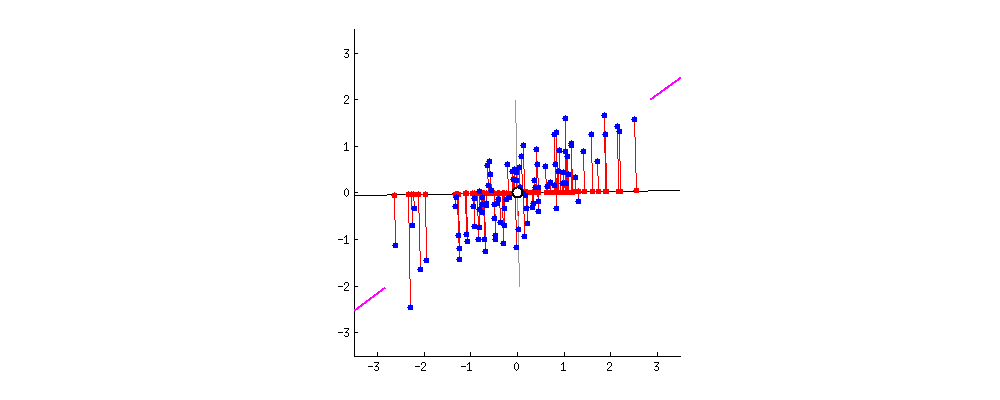

```{r setup, include=FALSE}
# clear-up the environment
rm(list = ls())

# chunk options
knitr::opts_chunk$set(
  message = FALSE,
  warning = FALSE,
  fig.align = "center",
  comment = "#>"
)

options(scipen = 123)
```

# Introduction: Machine Learning

Tujuan dari machine learning adalah membuat **mesin yang dapat belajar sendiri** dalam memahami pola data hingga mengestimasi apa yang akan terjadi di masa depan.

# Supervised vs Unsupervised Learning

1. Supervised Learning: memiliki target variabel

   * Regression: target variabelnya **numerik**

   * Classification: target variabelnya **kategorik**

2. Unsupervised Learning: tidak memiliki target variabel

   * Clustering

   * Dimensionality Reduction

**Knowledge Check**

Dalam business case di lapangan, pemilihan variabel target biasanya dikaitkan dengan masalah bisnis yang ingin diselesaikan:

Kasus 1:

>Sebuah agen properti berusaha membangun sebuah model untuk menebak harga sebuah properti untuk digunakan sebagai acuan kontrol untuk menjaga harga pasar. Untuk itu, mereka mengembangkan sebuah model dengan:

- Variabel target: harga properi
- Variabel prediktor: luas properti, umum property, lokasi properti, model properti

Kasus 2:

>Seorang pemilik restoran ingin menebak berapa banyak penjualan yang akan dihasilkan oleh restorannya. Untuk itu mereka mengembangkan sebuah model dengan kriteria:

Variabel target: jumlah penjualan
Variabel prediktor: promosi, menu makanan, tempat/lokasi, wifi, fasilitas, weekend/weekday.

# Linear Regression

Mari memahami dasar dari linear regression yaitu **ordinary least squares** dengan studi kasus:

```{r}
# read data copiers
copiers <- read.csv("data_input/copiers.csv")
```

Copiers adalah data online retailer yang menjual mesin potokopi.

```{r}
# inspect data
str(copiers)
```

BQ: Misalkan kita ingin memprediksi profit berdasarkan nilai sales. Tentukan:

* variable target (y): Profit
* variable prediktor (x): sales

**Eksplorasi data**:

**1. Cek persebaran data**

Cek persebaran variable Profit:

```{r}
boxplot(copiers$Profit)
```

Insight: 
- outlier -> ada -> bisa memengaruhi
- distribusi -> rendah, berkisar antara 200-800 an

Cek persebaran variable Sales:

```{r}
boxplot(copiers$Sales)
```

Insight: 
- distribusi: rendah, berkisar antara 800 - 1900an
- outlier:ada

**Korelasi antar variable target dan prediktor**


```{r}
# nilai korelasi
cor(copiers$Sales, copiers$Profit)
```

> Korelasi antara Profit dan Sales kuat positif.

```{r}
# visualisasi scatter plot
plot(copiers$Sales, copiers$Profit)
```

> Indikasi bahwa sales adalah **prediktor yang baik** untuk memprediksi Profit.

## Simple Linear Regression

**Model tanpa variable prediktor:**

`lm(y ~ x, data)`

```{r}
# buat model
model_base <- lm(formula = Profit ~ 1, data = copiers) # 1 menandakan tanpa prediktor

# print summary model
summary(model_base)
```

Coefficient intercept model tanpa prediktor adalah mean dari target variable:

```{r}
mean(copiers$Profit)
```

```{r}
plot(copiers$Profit)
abline(h = mean(copiers$Profit), col = "red")
```


**Model dengan variable prediktor:**

```{r}
# buat model
model_ols <- lm(formula = Profit ~ Sales, data = copiers)

# summary model
summary(model_ols)
```

Dihasilkan **koefisien intercept** dan **koefisien untuk setiap prediktor**, sehingga formula model regresi:

$$\hat{y}=\beta_0+\beta_1.x_1+...+\beta_n.x_n$$. 

dimana, $\beta_0$ adalah intercept, $\beta_1, ..., \beta_n$ adalah coefficient prediktor, dan $x_1,...,x_n$ merupakan variable prediktor yang digunakan.

Sehingga formula model yang diperoleh:

$$Profit = -114.0625 + 0.4229*{Sales}$$

Ketika kita memiliki Sales bernilai 1000, berapa jumlah Profit yang didapatkan?

```{r}
-114.0625 + (0.4229*1000)
```

Bila garis regresi diplot kan maka menghasilkan sebagai berikut:

```{r}
plot(copiers$Sales, copiers$Profit)
abline(model_ols, col = "red")
```

* intercept: titik dimana garis bersinggungan dengan sumbu y
* coefficient prediktor: slope/kemiringan garis

**Important Points**:

* Pada linear regression, prediktor yang baik adalah yang memiliki korelasi kuat dengan target.
* Model Linear Regression membuat suatu garis lurus yang menangkap pola data sehingga menghasilkan error terkecill.
* Formula garis regresi dapat digunakan untuk prediksi.

## Ordinary Least Squares (Concept)

Ordinary least squares bekerja dengan **mencari suatu garis lurus yang dapat merepresentasikan pola data**, dalam kata lain menghasilkan error terkecil. Error yang dimaksud adalah **Sum of Squared Error (SSE)** 

* Error: selisih dari nilai prediksi ($\hat{y}$) dengan nilai actual ($y$)

$$error = y - \hat{y}$$

* Sum of Squared Error (SSE): 

$$\sum^n_{i=1}(y_i - \hat{y}_i)^2$$
Penjelasan formula:

1. **Error** dihitung untuk masing-masing data
2. **Dikuadratkan** agar nilai error positif dan error negatif tidak saling menghilangkan
3. **Dijumlahkan** untuk mendapatkan suatu nilai yang merepresentasikan error keseluruhan data

```{r, out.width = "100%", echo = FALSE, fig.align = "center"}

```

**Summary Day 1**

**Workflow Regression**:

* business question: ketahui target & prediktor
* read data + cleaning data
* eda: 
  + cek outlier: ada/tidak. bisa dicek nanti, bila menurunkan performa model dibuang saja.
  + cek korelasi target - prediktor: cari prediktor potensial
* modelling: `model <- lm(target ~ prediktor, data)`
* interpretasi model: `summary(model)` -> dibahas di day 2

---
**START OF DAY 2**

## Interpretasi Model

Model Machine Learning memiliki beberapa sifat,
  + robustness: performa model yang tinggi, errornya rendah 
  + interpretability: bisa tau pengaruh tiap prediktor (meningkatkan/menurunkan target)

Umumnya: 
  + model sederhana: interpretability tinggi, robustness rendah
  + model kompleks: interpretability rendah, robustness tinggi

> Salah satu keunggulan model linear regression adalah interpretability.

```{r}
summary(model_ols)
```

> Profit = -114.06251 + 0.42286 * Sales

1. **Intercept**: titik awal garis regresi terbentuk, menunjukkan nilai target ketika nilai prediktor = 0
   
   >  Saat Sales 0, profit = -114.06251 (rugi) 
  
2. **Coefficient/Slope**: kenaikan variable target setiap 1 satuan
  + Koefisien positif = korelasi positif, meningkatkan nilai variable target
  + Koefisien negatif = korelasi negatif, menurunkan nilai variable target
  
  > Sales menaikkan Profit
  
3. **Signifikansi prediktor**: mengetahui apakah setiap prediktor berpengaruh signifikan terhadap variable targetnya.
  + Sebuah prediktor dikatakan signifikan ketika p-value < 0.05 (alpha)
  + Bisa juga dilihat dari jumlah bintang setiap prediktor
  
  > Variable yg signifikan: Sales
  
4. **R-squared**: ukuran **kebaikan model**. Seberapa baik model dapat menjelaskan target. 
  + rentang nilai 0-1, mendekati 1 semakin baik
  
  > Prediktor yg kita gunakan pada model bisa menjelaskan sebanyak 88.28% variansi dari target variable, sedangkan sisanya dijelaskan oleh variable lain di luar model.

```{r}
head(copiers)
```
Latihan: Buat model prediksi `Profit` dengan prediktor `Discount`

```{r}
# buat model
model_ols_disc <- lm(Profit ~ Discount, copiers)

# summary
summary(model_ols_disc)
```
Interpretasi:

1. Intercept: 
   > Saat tidak ada Discount, maka Profit senilai 689.25
   
2. Coef Discount: 
   > Korelasi negatif, discount menurunkan Profit. 
   > Ketika Discount naik 1 satuan maka menurunkan Profit sebesar 1487.19
  
3. Prediktor Significant: `Discount` 

4. R-squared: Model bisa menjelaskan sebanyak 18.69% dari target.

## Prediksi

Prediksi nilai profit misalkan kita punya data sales sebagai berikut:

```{r}
sales <- data.frame(Sales = c(300,290,320,450))
sales
```

Agar bisa menghitung langsung semuanya, gunakan function `predict()`:

```{r}
predict(object = model_ols, newdata = sales)
```

Kesimpulan: fungsi `predict()` prediksi ini untuk memprediksi data baru berdasarkan model yang dibuat berdasarkan data yg lama (belajar dari data historis)

**Knowledge Check Day **

1. Machine Learning terbagi 2. Machine learning yang *memiliki target variable* adalah:
[x] Supervised -> memiliki target (tau mau memprediksi apa)
[ ] Unsupervised -> tidak memiliki target (tidak untuk prediksi, eda)

2. Supervised Learning dapat terbagi 2 berdasarkan target variable yaitu Regresi dan Klasifikasi. *Regresi* memiliki target variable yang ... 
[x] numeric 
[ ] kategorik

3. **Regresi Linear** membuat garis lurus yg dapat menangkap pola data antara target variable dengan prediktor. Prediktor yang baik adalah:
[ ] memiliki korelasi positif dengan target -> positif lemah tidak baik
[ ] memiliki korelasi negatif dengan target -> negatif lemah tidak baik
[x] memiliki korelasi kuat dengan target -> di cek melalui fungsi `cor()`

4. Dari model regresi yang terbentuk, bile koefisien prediktor positif, maka ...
[x] peningkatan nilai prediktor akan meningkatkan nilai target
[ ] peningkatan nilai prediktor akan menurunkan nilai target
[ ] prediktor pasti merupakan prediktor yang signifikan -> bisa aja tidak signifikan

5. Nilai R-squared merupakan salah satu tools untuk menentukan kebaikan model. R-squared yang diinginkan adalah ...
[ ] nilainya semakin tinggi
[ ] nilainya mendekati 0
[x] nilainya mendekati 1

# Leverage vs Influence

**Outlier** adalah data yang nilainya jauh dari kebanyakan data lainnya, dan umumnya mengganggu pemodelan. 

Outlier dimana nilai sumbu x nya jauh dari kebanyakan data disebut **high leverage**. Outlier berpotensi untuk sangat mempengaruhi koefisien (intercept, slope) dan r-squared dari model regresi (**high influence**). Untuk membuktikannya kita perlu melihat summary model.

* leverage mempengaruhi model: high influence
* leverage tidak mempengaruhi model: low influence

Practical Notes:
1. Buat model dengan outlier (data awal) -> cek performa model
2. Kalau performa masih buruk -> cek ada outlier/tidak
3. Kalau ada outlier, coba dibuang -> buat model tanpa outlier
4. Cek performa model lagi
   + bila outlier tidak merubah/meningkatkan R-squared, sebaiknya dipertahankan. 
   + bila outlier menurunkan R-squared, sebaiknya dibuang.

Sejauh ini, kita sudah membuat `model_ols` yang menggunakan seluruh observasi. Lakukan exploratory data dengan melihat apakah terdapat outlier pada variable `Sales`:

```{r}
# boxplot sales
boxplot(copiers$Sales)
```

```{r}
# plot target dan prediktor
plot(copiers$Sales, copiers$Profit)
abline(model_ols, col = "red")
```

Coba buang data outlier:

```{r}
# versi base
copiers_new <- copiers[copiers$Sales < 4000,]

# versi dplyr
library(dplyr)
copiers_new <- copiers %>% 
            filter(Sales < 4000)
```

Buatlah model linear regression dengan data tanpa outlier:

```{r}
model_no_outlier <- lm(Profit ~ Sales, copiers_new)
```

Bandingkan **garis regresi** yang dibentuk dari `model_ols` dan `model_no_outlier`, apakah data outlier menghasilkan output yang jauh berbeda?

```{r}
plot(copiers$Sales, copiers$Profit)
abline(model_ols, col = "red")
abline(model_no_outlier, col = "green")
```

**Insight**: Secara visual, garis prediksi model tanpa outlier (garis hijau) tidak jauh berbeda dengan garis regresi dengan outlier (garis merah). Indikasi bahwa outlier tersebut *Low influence*

Mari pastikan pula perbandingan nilai goodness of fit (**R-squared**) nya:

```{r}
summary(model_ols)$r.squared
summary(model_no_outlier)$r.squared
```

**Insight**: r-squared lebih bagus pada `model_ols`(model dengan outlier), maka outlier tidak perlu dibuang.

**Knowledge Check**

Terdapat data dengan high leverage. Setelah dicoba pembuatan model dengan dan tanpa outlier, ternyata data tersebut HIGH INFLUENCE (berpengaruh besar utk model kita). Maka yang dilakukan ...

- [ ] Menggunakan model dengan outlier
- [X] Menggunakan model tanpa outlier

---

# Multiple Linear Regression

Penggunaan lebih dari 1 prediktor dapat meningkatkan performa model karena lebih banyak informasi yang dapat menjelaskan target.

Pemilihan prediktor (**feature selection**):

* berdasarkan bisnis
* berdasarkan statistik:
  + correlation
  + stepwise regression (dipelajari hari ke-3)

1. Dataset

```{r}
head(copiers)
```

```{r}
table(copiers$Ship.Mode)
```

Penentuan variable:

* target: Profit
* prediktor (berdasarkan business): 
  + buang: row.id, order.id, product.id, customer.id, category & sub category
  + buang product.name (yang memiliki jumlah kategori terlalu banyak, atau kemungkinan di lapangan akan ada data baru) -> buang aja. karena model kita jadi terlalu spesifik, hanya bisa memprediksi yang ada pada data awal
  + buang tipe date (full date): jarang digunakan sebagai prediktor: pada data baru pasti tanggalnya berbeda. 

2. Data Wrangling:

```{r}
# seleksi dan ubah tipe data
copiers <- copiers %>% 
  select(Ship.Mode, Segment, Sales, Quantity, Discount, Profit) %>% 
  mutate(Ship.Mode = as.factor(Ship.Mode),
         Segment = as.factor(Segment))

# cek missing value = tidak ada
anyNA(copiers)

# cek data
head(copiers)
```

3. Eksplorasi data (*Exploratory Data Analysis*)

Contoh untuk cek outlier sudah dilakukan di hari pertama, dan dapat dilakukan untuk seluruh variable numerik lainnya. Namun untuk saat ini kita gunakan terlebih dahulu outlier yang ada.

**Cek korelasi** prediktor - target:

```{r}
# cara manual
cor(copiers$Profit, copiers$Sales)
cor(copiers$Profit, copiers$Quantity)
cor(copiers$Profit, copiers$Discount)
```

```{r}
# cara 2: menggunakan fungsi `ggcorr()`
library(GGally)
ggcorr(copiers, label = T)
```

**Insight**: prediktor potensial berdasarkan kuatnya nilai korelasi: sales - quantity paling kuat. discount agak lemah, tapi tidak terlalu lemah jadi masih bisa dicoba utk jadi prediktor. 

4. Modelling

Bentuk model menggunakan seluruh variable prediktor:

```{r}
# buat model
model_ols_multi <- lm(Profit ~ ., copiers)  

# summary model
summary(model_ols_multi)
```

Formula regresi untuk model di atas:

$$
Profit =
63.452 \\
+ 9.13795 * Ship.ModeSame Day \\
+ 42.97158 * Ship.ModeSecond Class \\
+ 13.92121 * Ship.ModeStandard Class \\
+ 9.30122 * SegmentCorporate \\
- 30.70992 * SegmentHome Office \\
+ 0.42124 * Sales \\
- 13.40975 * Quantity \\
- 874.83099 * Discount
$$

**Insight**:

* interpretasi prediktor (numerik):
  - meningkatkan profit: Sales (karena coef bernilai positif)
  - menurunkan profit: Quantity, Discount (karena coef bernilai negatif)
  
* interpretasi prediktor (kategorik):
  - setiap nilai dari kolom kategorik akan dijadikan 1 entitias (dummy variable)
  - akan ada 1 nilai yang menjadi basis (di intercept), tidak ditampilkan koefisiennya
  - cara interpretasi: 
    + Segmen = Corporate, maka target meningkat
    + Segmen = Home Office maka target menurun 
    + Segmen = Consumer, maka target tidak ditambah/dikurang (mengikuti intercept)
  
* signifikansi prediktor: Sales & Discount.
  + bila ada variable yg tidak signifikan, kita bisa coba hapus saja dr model. karena mungkin pengaruhnya tidak banyak ke target kita. mungkin hanya memberikan noise/data random yang bisa memperburuk data kita. 
  + untuk memastikannya harus dicoba menggunakan pembuatan model baru

* adj. r-squared: 0.9442

Note: 

* kalau simple linear regression: *multiple r squared*
* kalau multiple linear regression: *adj. r. squared*
  + semakin banyak prediktor maka R-squared otomatis meningkat
  + adjusted R-squared menghitung R-squared sambil memperhitungkan/melakukan penalty untuk jumlah prediktor yang digunakan. Adj. R-squared hanya akan meningkat bila prediktor memang menghasilkan prediksi yang lebih baik, bukan hanya menambahkan informasi random.
  
**Summary Day 2:**

* Interpretasi model: `summary(model)`
  + koefisien prediktor: positif/negatif -> meningkatkan/menurunkan target
  + prediktor signifikan: lihat dari p-value/jumlah bintang
  + r-squared: 
    + nilai kebaikan model dalam menjelaskan target
    + rentang 0-1: mendekati 1 semakin baik

* Leverage: outliers pada prediktor 
  + Leverage dapat memengaruhi model secara signifikan     
  + Leverage tetap dimasukkan ke dalam model apabila berpengaruh baik pada model

* Multiple linear regression: prediktor > 1
  + r.squared:
    - utk multiple linear regression gunakan adj.r.squared
    - utk simple linear regression gunakan multiple r.squared

* Prediksi: `predict(model, newdata)`  
  
---
**START OF DAY 3**
  
Karena terdapat variable tidak signifikan, mari coba gunakan variable yang signifikan saja:

```{r}
summary(model_ols_multi)
```


```{r}
# your code
model_ols_multi2 <- lm(Profit~Sales + Discount, copiers)

# summary model
summary(model_ols)$r.squared
summary(model_ols_multi)$adj.r.squared
summary(model_ols_multi2)
```

Insight: adj. r-squared adalah ...

# Prediksi 

Di materi ini kita belum ada data baru. Kita akan gunakan model untuk memprediksi data copiers (yg kita gunakan untuk pemodelan).

Kita akan gunakan model yang telah dibuat:

* model_ols: 1 prediktor (Sales)
* model_ols_multi: Semua prediktor
* model_ols_multi2: Prediktor signifikan (Sales + Discount)

```{r}
# simpan hasil prediksi ke kolom baru `prediction` di data `copiers_multi`
pred_ols <- predict(model_ols, newdata = copiers)
pred_ols_multi <- predict(model_ols_multi, newdata = copiers)
pred_ols_multi2 <- predict(model_ols_multi2, newdata = copiers)

pred_ols
pred_ols_multi
pred_ols_multi2
```

Kita akan bandingkan dari ketiga model, manakah yang memiliki performa terbaik melalui evaluasi model!

# Evaluasi Model

Diinginkan **error prediksi** yang **terkecil**.

`error = data aktual - hasil prediksi`

Tiap baris observasi akan menghasilkan error, sehingga butuh 1 nilai untuk mewakili nilai error tersebut, umumnya adalah rata-rata error. Berikut beberapa metrics error yang bisa digunakan untuk regresi:

1. **MAE** (Mean Absolute Error)
2. **MSE** (Mean Squared Error)
3. **RMSE** (Root Mean Square Error)

Masing-masing memiliki cara perhitungan, kelebihan dan limitasi. Untuk lebih detail dapat lihat di [Slide](https://docs.google.com/presentation/d/1GIeZaG3jYaKfZfZWXmho413zORbH9ZRlCzmxHMA9qmc/edit#slide=id.ge6c7850925_1_16)

1. **Pilih error yang dipakai:** berdasarkan benefit dan limitasinya

* **mae**: kalau harus menjelaskan ke orang yg bukan berlatar belakang statistik dan bisa mengabaikan error outlier yang besar
* **mse**: tidak bisa diinterpretasi. biasanya cuma untuk membandingkan model terbaik untuk kita pribadi, lebih sulit untuk dijelaskan ke khalayak.
* **rmse**: rmse lebih merepresentasikan error (kalau ada error besar bisa terdeteksi), dan bisa diinterpretasikan juga karena sudah nilai asli. biasanya presentasi untuk khalayak akademisi/analis data.

Error yang dipilih: ...

2. **Evaluasi model**

Berdasarkan nilai R-squared: 

```{r}
# your code
summary(model_ols)$r.squared

hasil_mse <- (2.1^2 + 2.1^2)/2

sqrt(hasil_mse)
```

Based on error:

```{r}
library(MLmetrics)
# your code
RMSE(y_pred = pred_ols, y_true = copiers$Profit)
RMSE(y_pred = pred_ols_multi, y_true = copiers$Profit)
RMSE(y_pred = pred_ols_multi2, y_true = copiers$Profit)
```

**Kesimpulan**: 

Bila kita ingin mengetahui apakah RMSE tersebut sudah cukup kecil untuk data kita, bandingkan dengan range variable target:

```{r}
range(copiers$Profit)
```

Interpretasi RMSE: hasil prediksi yang dihasilkan model memiliki kemungkinan salah .... dari titik prediksinya.

Note: interpretasi MAE pun caranya sama (+- dari hasil prediksi)

# Dive Deeper: Inequality Prediction

1. Read data `crime`:

```{r}
crime <- read.csv("data_input/crime.csv") %>% select(-X)
names(crime) <- c("percent_m", "is_south", "mean_education", "police_exp60", "police_exp59", "labour_participation", "m_per1000f", "state_pop", "nonwhites_per1000", "unemploy_m24", "unemploy_m39", "gdp", "inequality", "prob_prison", "time_prison", "crime_rate")
head(crime)
```

Deskripsi kolom:

* `percent_m`: percentage of males aged 14-24
* `is_south`: whether it is in a Southern state. 1 for Yes, 0 for No.
* `mean_education`: mean years of schooling
* `police_exp60`: police expenditure in 1960
* `police_exp59`: police expenditure in 1959
* `labour_participation`: labour force participation rate
* `m_per1000f`: number of males per 1000 females
* `state_pop`: state population
* `nonwhites_per1000`: number of non-whites resident per 1000 people
* `unemploy_m24`: unemployment rate of urban males aged 14-24
* `unemploy_m39`: unemployment rate of urban males aged 35-39
* `gdp`: gross domestic product per head
* `inequality`: income inequality
* `prob_prison`: probability of imprisonment
* `time_prison`: average time served in prisons
* `crime_rate`: crime rate in an unspecified category

2. Data Wrangling:

```{r}
# ubah tipe data
crime_change <- 
  crime %>% 
    mutate_at(.vars=c('mean_education','labour_participation','unemploy_m24','unemploy_m39'),
              .fun=as.numeric)
# cek missing value
anyNA(crime_change)
```

3. EDA - Cek korelasi variable:

```{r}
# hint: bila tulisan tidak rapih, tambahkan argumen di fungsi:
# `hjust = 1` agar tulisan tidak menyentuh kotak
# `layout.exp = 3` agar panel membesar 3 poin

ggcorr(crime_change, hjust=1, layout.exp=3, label=T)

```

Insight: ...

4. Buatlah model regresi linear untuk memprediksi **inequality** berdasarkan 1 variable paling potensial:

```{r}
# buat model
model_ineq <- lm(inequality~gdp, crime)
model_ineq_all <- lm(inequality~., crime)
```

```{r}
# summary model
summary(model_ineq)$r.squared 
summary(model_ineq_all)$adj.r.squared

summary(model_ineq)
summary(model_ineq_all)
```

Interpretasi model: 

* variable prediktor (menurunkan) nilai target
* signifikansi prediktor: gdp 
* r-squared: 0.7815

5. Buatlah model linear menggunakan seluruh variable:


Interpretasi:

* signifikansi prediktor: gdp (***), crime_rate (**), mean_education(*)
* r-squared: 0.8692

6. Evaluasi Model

Bandingkan R-squared `model_ineq` dan `model_ineq_all`:

```{r}

RMSE(y_pred = pred_ols, y_true = crime$inequality) 
RMSE(y_pred = pred_ols_all, y_true = crime$inequality)

```

Bandingkan RMSE `model_ineq` dan `model_ineq_all`:

```{r}
summary(model_ineq)$r.squared
summary(model_ineq_all)$adj.r.squared

pred_ols <- predict(model_ineq, crime)
pred_ols_all <- predict(model_ineq_all, crime)

RMSE(y_pred = pred_ols, y_true = crime$inequality) 
RMSE(y_pred = pred_ols_all, y_true = crime$inequality)
 
 
```

Kesimpulan: 

---

# Step-wise Regression

Pemilihan prediktor pada model, selain didasari business insight bisa didukung secara statistik.

Stepwise regression mencari kombinasi prediktor yang menghasilkan model terbaik berdasarkan nilai **AIC** (Akaike Information Criterion / Information Loss). AIC menunjukkan banyak informasi yang hilang pada model. Diinginkan AIC yang semakin kecil.

* **backward elimination**
* **forward selection**
* **both**

### Backward

Mulai dari menggunakan seluruh prediktor, kemudian dikurangi 1 per 1 variable prediktor sehingga diperoleh AIC terkecil.

1. Menggunakan seluruh variable

2. Memilih variable yang ketika dihilangkan, menghasilkan AIC terbaik (rendah)

3. Menghilangkan variable yang dipilih dari tahap kedua

4. Mengulangi step 2 dan step 3 

5. Proses berhenti bila saat dilakukan pengurangan variable lagi malah menghasilkan AIC yang lebih tinggi.

```{r}
# persiapan: buat model seluruh prediktor
model_ineq_all
```

```{r}
# stepwise regression - backward
model_backward <- 
```

```{r}
# cek summary model
summary(model_backward)
```

### Forward

Mulai dari model tanpa prediktor, kemudian ditambahkan 1 per 1 variable prediktor sehingga diperoleh model AIC terkecil.
 
1. Tidak menggunakan variable apapun

2. Memilih variable yang ketika ditambahkan menghasilkan AIC terbaik (rendah)

3. Menambahkan variable yang dipilih dari tahap kedua

4. Mengulangi step 2 dan 3 

5. Proses berhenti bila saat dilakukan penambahan variable lagi malah menghasilkan AIC yang lebih tinggi.

```{r}
# persiapan: buat model tanpa prediktor
model_ineq_none <- lm(inequality ~ 1, data = crime)
```

```{r}
# stepwise regression - forward
model_forward <- 
  
```

```{r}
# cek summary model
summary(model_forward)
```

### Both 

Pengurangan dan penambahan prediktor dilakukan bersamaan hingga didapatkan AIC terkecil.

1. Menggunakan model tanpa prediktor.

2. Memilih penambahan variable atau pengurangan variable yang menghasilkan AIC terbaik.

3. Menambahkan atau mengurangi variable yang dipilih dari tahap kedua

4. Meneruskan step 2 dan 3 hingga nilai AIC terbaik dihasilkan.

```{r}
# buat stepwise regression - both
model_both <- 
```

```{r}
# cek summary model
summary(model_both)
```

Nilai adjusted R-squared pada ketiga model dapat dibandingkan:

```{r}
summary(model_backward)$adj.r.squared
summary(model_forward)$adj.r.squared
summary(model_both)$adj.r.squared
```

Hasil ketiga step-wise regression kurang lebih sama. Bisa digunakan yang paling praktis untuk kita.

**Pertanyaan**: Kalau ada prediktor yang secara bisnis penting, namun dibuang pada stepwise regression, apa yang harus dilakukan?

**NOTE:** Stepwise regression merupakan **greedy algorithm** yang fokus pada mencari *hasil baik dengan waktu paling cepat*, namun belum tentu memberikan hasil paling optimal.

**Summary Day 3:**

* Evaluasi model:
  + diinginkan error kecil
  + ragam metrics/nilai error: 
    - ... : bisa diinterpretasikan, tidak sensitif terhadap outlier
    - ... : bisa diinterpretasikan, sensitif terhadap outlier
    - ... : tidak bisa diinterpretasikan, sensitif terhadap outlier, digunakan untuk membandingkan model untuk keperluan pribadi
  + pilih 1 metrics error, kemudian dibandingkan error dari masing-masing model. pilih model yang menghasilkan error terkecil.

* **Step-wise Regression**: mencoba kombinasi prediktor hingga dihasilkan AIC (information loss) terkecil.
  + tipe stepwise: ...
  + hasil ketiganya tidak jauh berbeda, gunakan yang paling praktis


    
    
    
    
    
    
    
    