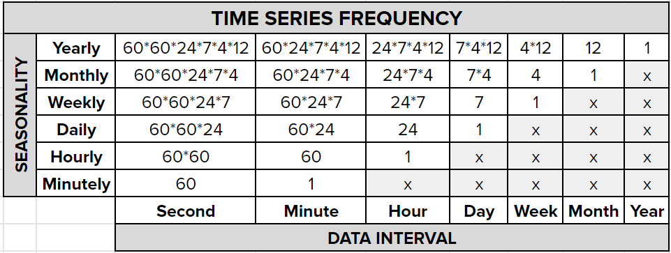
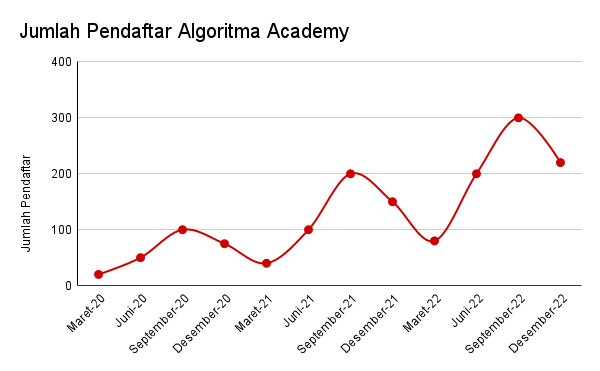

```{r setup, include=FALSE}
# clear-up the environment
rm(list = ls())

# chunk options
knitr::opts_chunk$set(
  message = FALSE,
  warning = FALSE,
  fig.align = "center",
  comment = "#>"
)

# prevent scientific notation
options(scipen = 100)

# load library
library(tidyverse) #data manipulation
library(lubridate) # date manipulation
library(padr) # TS padding
library(zoo) # imputasi missing value TS
library(fpp) # TS dataset

library(forecast) # time series library
library(TTR) # SMA function
library(tseries) # adf.test
library(MLmetrics) # calculate error

# supaya semua plot memiliki theme_minimal()
theme_set(theme_minimal())
```

# Introduction

```{r, echo=FALSE}
knitr::include_graphics("assets/Time Series Forecasting.png")
```

1. Time series data: merupakan data yang berhubungan dengan waktu yang memiliki interval waktu yang sama

2. Forecasting: merupakan suatu metode untuk memprediksi/meramalkan data di masa depan

**Apa perbedaan Time Series dengan Regresi?**

Perbedaan mendasar antara time series dengan regresi adalah jika pada regresi untuk memprediksi suatu nilai Y dipengaruhi oleh beberapa faktor yaitu x1,x2,..,xn. Sedangkan jika **time series**, untuk memprediksi suatu nilai Y dipengaruhi oleh nilai Y itu sendiri pada masa lampau ($Y_{t-1}$). 


*Regression*

$$y = \beta_0+\beta_1*x_1+\beta_2*x_2+...+\beta_n*x_n$$

*Time Series*

$$y_t = \beta_0+\beta_1*y_{t-1}+\beta_2*y_{t-2}+...+\beta_n*y_{t-n}$$
# Time Series Data

## Objek Time Series

Untuk analisis time series di R, kita perlu convert data kita menjadi **objek ts**. Menggunakan fungsi `ts()`. Berikut parameter fungsinya:

> ts(data, start, frequency)

* `data`  = variabel yang ingin diamati (target)
* `start` = periode awal data (optional)
* `frequency` = pola berulang dari data

Cara menentukan frequency: 

1. cek data direkam per satuan waktu apa?
2. pola yang ingin dilihat per satuan waktu apa?
3. frekuensi = berapa data dalam 1 musim/seasonal

Contoh:
- Jika saya memiliki data harian dan ingin mendapatkan pola mingguan, maka frequency = 7
- Jika saya memiliki data harian dan ingin mendapatkan pola bulanan, maka frequency = 7*4

```{r out.width="60%", fig.align='center', echo=FALSE}

```

**Dive deeper :**

Tentukan frequency dari data time series berikut:

* Sebuah cafe mencatat total pengunjung yang data per jam, apabila ingin dilihat pola harian, maka:
  - Dengan asumsi buka 24 jam, maka frequency = 24
  - Dengan asumsi hanya buka 12 jam, maka frequency = 12

* Sebuah perusahaan retail mencatat total sales per bulan, maka apabila:
  - ingin dilihat pola sales tahunan, maka frequency = 12
  - ingin dilihat pola sales kuartalan, maka frequency = 3
  
* Lihatlah visualisasi time series di bawah. Algoritma mencatat jumlah pendaftar Academy pada periode waktu tertentu dan ingin dipertimbangkan pola tahunan, maka frequency = 4

```{r out.width="60%", fig.align='center', echo=FALSE}

```

Sekarang, mari coba membuat objek ts. Berikut adalah data emisi gas Indonesia sejak tahun 1970 hingga 2012 per tahunnya.

```{r}
# read data
library(janitor)
co2 <- read.csv("data_input/environment_1970f.csv") %>% 
  clean_names()
head(co2)
```

Buatlah objek time series dari *Carbon Dioxide (CO2) Emission Metric Tons per Capita* dengan seasonality tahunan (per 1 tahun):

```{r}
# simpan dalam object ts
gas_ts <- ts(data=co2$co2_emissions_metric_tons_per_capita,
             start='1970',
             frequency=1)
  
gas_ts
```

Cek class dari data `gas_ts`
```{r}
# class ts object
class(gas_ts)
```

Buat visualisasinya dengan fungsi `autoplot()`:

```{r}
# inspect pola data
gas_ts %>% 
  autoplot() + geom_point()

```

Untuk visual yang lebih jelas di rentang waktu tertentu, kita bisa gunakan `window()`:

```{r}
gas_ts %>%  
  window(start=1990,
         end=2010) %>% 
  autoplot() + geom_point()
```

Insight: ...

## Syarat Data Time Series

**1. Data harus terurut berdasarkan waktu**

```{r}
dat <- data.frame(year = c(2010,2012,2011,2013,2014), value = c(10,15,12,17,16))
dat
```

```{r}
# mengurutkan berdasarkan year
dat %>% arrange(year)
```

**2. Tidak boleh ada waktu yang bolong**

```{r}
dat <- data.frame(date = as.Date(c("2020-02-01","2020-02-03","2020-02-04")),
                                 value = c(23,34,20))
dat
```

```{r}
library(padr)
dat <- dat %>% pad()
```

3. **Tidak boleh ada NA**

Cara yang umum dilakukan dengan package `zoo`:

a. `na.fill()`: mengisi `NA` dengan sebuah nilai, Gunakan `fill="extend"` untuk mengisi dengan nilai rata-rata dengan nilai yang missing 
b. `na.aggregate()`: nilai aggregasi (mean, median)
c. `na.locf()`: nilai terakhir sebelum missing

```{r}
library(zoo)

dat %>% 
  mutate(value= na.locf(value))

dat %>% 
  mutate(value= na.aggregate(value,'median'))

dat %>% 
  mutate(value= na.fill(value,0))

dat %>% 
  fill(value, .direction=c('up'))
```

Note: Referensi Pre-processing Data Time Series dapat ditemukan [disini](https://askalgo.netlify.app/#data-preprocessing)

**Dive Deeper!**

1. Read data `nybirth.csv` 

```{r}
birth <- read.csv("data_input/nybirth.csv")
head(birth,20)
```

Data `births` merupakan data persentase kelahiran di New York per bulan. Terdiri dari:

- `date`: tanggal saat dilakukan pencatatan persentase kelahiran
- `births`: persentase tingkat kelahiran.

Cek class data birth

```{r}
class(birth)
```

2. Lakukan data preprocessing:

```{r}
# menyesuaikan tipe data `date`
birth$date <- ymd(birth$date)
```

3. Mengetahui range atau periode waktu data `birth`

```{r}
range(birth$date)
```

4. Cek apakah data sudah memenuhi syarat data time series yang baik?

- data harus urut
- interval tetap 
- tidak ada missing value

```{r}
# urut
birth <- birth %>% 
  arrange(date) %>% 
  pad()
colSums(is.na(birth)) 
```

5. Membuat object time series. Pola yang ingin dilihat adalah pola tahunan.

```{r}
birth_ts <- ts(data=birth$births,start=c(1946,1),frequency=12)
```

6. Lihatlah visualisasi object `birth_ts`
```{r}
birth_ts %>% autoplot()
```

# Decomposition

**Decomposition** adalah suatu tahapan dalam time series analisis yang digunakan untuk menguraikan beberapa komponen dalam time series data. 

Komponen/unsur dalam time series :

- **Trend** : pola data secara general, cenderung naik atau turun
- **Seasonal** : pola yang berulang pada periode waktu yang tetap/sama
- **Residual/Error** : pola yang tidak dapat ditangkap dalam trend dan seasonal

Untuk dapat menguraikan object time series kita menjadi 3 komponen tersebut, kita dapat menggunakan fungsi `decompose()`.

```{r}
birth_dc <- 
```

Visualisasi hasil decompose:

```{r}

```

Pada hasil decompose kita mendapatkan informasi visualisasi:

1. Data : pola data asli
2. Seasonal (S) : pola musiman atau pola berulang dari data
3. Trend (T) : pola data secara global (naik atau turun)
4. Remainder (E) : pola data yang tidak dapat ditangkap oleh seasonal dan trend

Note: **Jika pada hasil decompose, trend masih membetuk sebuah pola maka dapat dicurigai masih ada seasonality yang belum ditangkap. Seharusnya trend cenderung naik atau cendurung turun.**

**Additive and Multiplicative**

Terdapat 2 jenis model pada data time series, yaitu :

```{r out.width="60%", fig.align='center', echo=FALSE}
knitr::include_graphics("assets/aditif vs multiplikatif.png")
```

1. **Additive**: Pola trend dan seasonal nya cenderung konstan.

$$Y_t = T_t + S_t + E_t$$

2. **Multiplicative**: Pola trend dan seasonal nya cenderung meningkat.

$$X_t = T_t * S_t * E_t$$
* Berikut ini contoh data time series yang bertipe additive :
```{r}
birth_ts %>%
  window(start=1948,end=1949) %>% 
  autoplot() + geom_point()
```

* Berikut ini contoh data time series yang bertipe multiplicative :
```{r}

```

Ketika kita menemukan pola data kita mengandung multiplikative :

> cara 1: membuat data multiplikative tersebut menjadi additive dengan fungsi `log`. Setelah memperoleh hasil forecast kita dapat mengembalikan nilainya dengan `exp`.

```{r}
# menggunakan AirPassenger

AirPassengers %>% autoplot()

log(AirPassengers) %>% autoplot()

decompose(log(AirPassengers)) %>% autoplot()


```

> cara 2: Tetap menggunakan model multiplikatif, kemudian nanti hasil dibandingkan dengan memilih model error yang paling kecil.

```{r}
# menggunakan AirPassenger
air_dc <- decompose(AirPassengers)

decompose(AirPassengers, type = "multiplicative") %>% autoplot()
```

**Mathematical Breakdown**

**Additive**

Formula: $X_t = T_t + S_t + E_t$

**1. Trend**

trend diperoleh dari hasil perhintungan `center moving average (CMA)`. Tujuan utamanya untuk **smoothing data** sehingga diperoleh trend yang cenderung naik/ cenderung turun.

```{r}
# data original
autoplot(birth_ts)
```

```{r}
# hasil informasi trend dari fungsi `decompose`
birth_dc$trend %>% 
  autoplot()
```

**Pendekatan manual menggunakan Center Moving Average**

```{r}
birth_trend <- ma(birth_ts, order = 12, # sesuai frequency
                  centre = T) # agar dihitung menggunakan center moving average
 
birth_trend %>% autoplot() + theme_minimal()
```

**2. Seasonality** 

```{r}
# hasil pola seasonal dari proses decompose
birth_dc$seasonal %>% 
  autoplot()
```

**Pendekatan manual**:

Formula Additive: `Data = Trend + Seasonal + Error`

Untuk mencari seasonal kita bisa buang trend terlebih dahulu. 

```{r}
# Detrend time series
birth_seas_er <- birth_ts - birth_trend

autoplot(birth_seas_er)
```

```{r}
# mean of each month
mean_month_birth <- birth_seas_er %>% 
  matrix(ncol = 12, byrow = T) %>% # ubah menjadi matrix 12 kolom (bulan)
  colMeans(na.rm = T) # hitung rata-rata per bulan

# mean global
mean_glob_birth <- mean(mean_month_birth) # adjusting seasonal

# seasonality calculation
seas_birth <- mean_month_birth - mean_glob_birth

# make it repetitive just like time series data
birth_seasonal <- ts(data = rep(seas_birth, 14), # for 14 years 
                     start = start(birth_ts), 
                     frequency = 12)

# plot it
birth_seasonal %>% autoplot() + theme_minimal()
```

**3. Error**

Untuk memperoleh informasi error, dapat menggunakan rumus:

*Error = Data - Trend - Seasonal*

```{r}
# hasil informasi error dari fungsi `decompose`
birth_dc$random %>%
  autoplot()
```

**Pendekatan manual**:

```{r}
birth_error <- birth_ts - birth_trend - birth_seasonal

birth_error %>% autoplot()
```

**Recomposed Time Series Additive Model**:

$$X_t = T_t + S_t + E_t$$

```{r}
birth_recomp <- birth_trend + birth_seasonal + birth_error

autoplot(birth_recomp) + theme_minimal()
```

**Multiplicative**

Penentuan trend, seasonal dan error pada data berpola Multiplicative masih sama, namun menggunakan formula:

$$X_t = T_t * S_t * E_t$$

### Seasonality Analysis

Seasonality analysis membantu kita mengetahui di waktu mana saja yang nilai datanya tinggi/rendah pada periode seasonal yang kita amati. 

Misalnya, dari objek `birth_ts` (seasonality tahunan) kita ingin mengetahui, bulan apa saja yang tingkat kelahirannya tinggi?

```{r}
seas_data <- birth %>% 
  mutate(seasonal = birth_dc$seasonal, # simpan seasonal hasil decompose
         month = month(ymd(date), label = T, abbr = T)) %>% # ambil informasi bulan
  distinct(month, seasonal) # ambil unique dari tiap bulan & seasonal

seas_data
```

```{r}
# ploting
seas_data %>% 
  ggplot(mapping = aes(x = month, y = seasonal)) +
  geom_col() + 
  theme_minimal()
```

Insight: 

* ...
* ...

### Seasonality Adjustment

Seasonality Adjustment adalah data time series yang sudah dibuang efek seasonal nya. Umumnya digunakan untuk lebih mudah mendeteksi error/kejadian luar biasa/anomali dari data (tidak terganggu efek seasonal). 

Berikut contoh data `birth_ts` dan `AirPassanger` yang sudah dibuang efek seasonalnya:

```{r}
library(xts)

# birth_ts
as.xts(birth_dc$x - birth_dc$seasonal) %>% 
  autoplot() %>% 
  plotly::ggplotly()
```

**Insight**: ...

```{r}
# AirPassanger
as.xts(air_dc$x/air_dc$seasonal) %>% 
  autoplot() %>% 
  plotly::ggplotly()
```

**Insight:** ...


-----End of day 1----------


