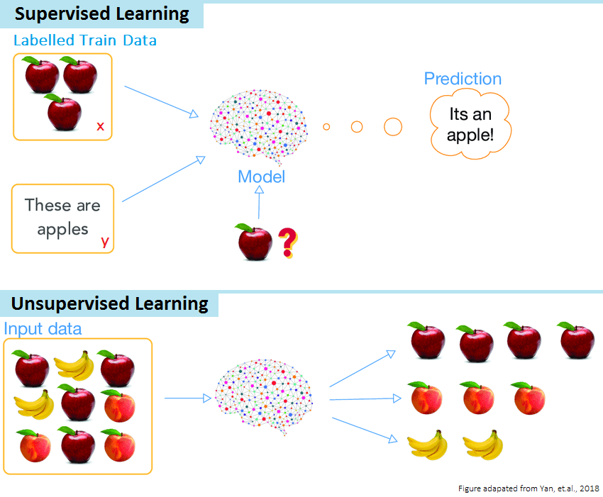
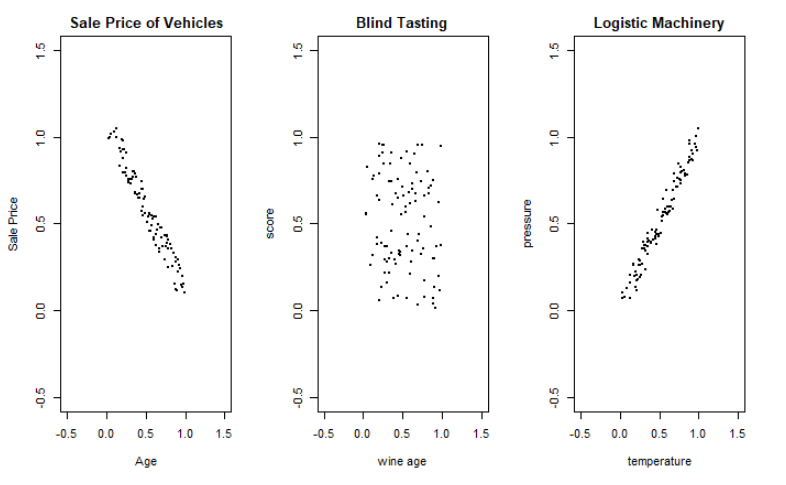
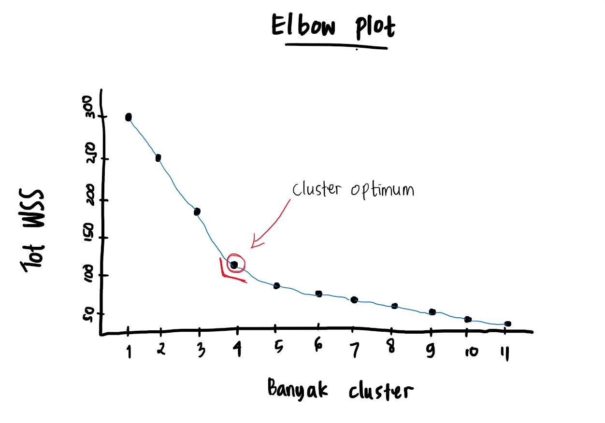

<style>

body {
text-align: justify}

</style>

```{r setup, include=FALSE}
# clear-up the environment
rm(list = ls())

# chunk options
knitr::opts_chunk$set(
  message = FALSE,
  warning = FALSE,
  fig.align = "center",
  comment = "#>"
)

options(scipen = 999)
```

<style>

body {
text-align: justify}

</style>

# Introduction
## Supervised Learning vs Unsupervised Learning

```{r, out.width = "60%", echo = FALSE, fig.align = "center"}

```

**Supervised Learning**

- Menemukan parameter X1, X2, ..., Xn yang dapat menjelaskan atau memprediksi respons "target" Y.
- Tujuannya untuk membuat model prediksi dengan menggunakan data train.
- Model dapat dievaluasi dengan data test.
- Digunakan untuk menyelesaikan permasalahan regresi dan klasifikasi.

**Unsupervised Learning**

- Tidak memiliki target variabel
- Model tidak dapat dilakukan evaluasi, karena tidak memiliki "ground truth" atau label aktual.
- Digunakan untuk mengidentifikasi kemungkinan untuk melakukan reduksi dimensi, clustering, atau untuk menemukan pola anomali atau yang tidak sesuai dengan data/pengamatan lainnya.
- Digunakan pada tahap Pre-processing maupun Exploratory Data Analysis (EDA)
karena berkaitan terutama dengan identifikasi pola pada data.

**Knowledge Check:**

1. Berikut ini merupakan real case supervised learning (pilih semua yang mungkin)

- [ ] Predicting customer churn (ada/tidak ada target)
- [ ] Predicting number of items (quantity) which a consumer will probably purchase (ada/tidak ada target)
- [ ] Predicting the number of shoppers who will pass in front of a particular billboard (ada/tidak ada target)

2. Di bawah ini merupakan real case unsupervised learning

- [ ] Email spam classifier
- [ ] Image compression
- [ ] Predicting real estate price

## Training Objectives
Dalam pembelajaran ini, kita akan mempelajari metode unsupervised learning yang digunakan secara luas mulai dari PCA (Principal Component Analysis), hingga Clustering, di mana variabel target tidak diketahui atau ditentukan.

```{r, out.width = "100%", echo = FALSE, fig.align = "center"}

```
_____

# Dimensionality Reduction
## Principle and Motivation
Machine learning semakin banyak diadopsi di bidang yang berhubungan dengan high-dimensional data. Kesulitan dalam memproses high-dimensional data:

- Menyulitkan pengolahan data (feature selection)
- Memerlukan komputasi yang besar
- Tidak efisien secara waktu
- Melakukan visualisasi lebih dari tiga dimensi

**Dimensionality reduction mengatasi masalah high-dimensional data**.Dimensionality reduction bertujuan untuk **mereduksi dimensi data** dengan tetap **mempertahankan sebanyak mungkin informasi yang ada**.

Istilah:

- **Dimensi**: variabel/kolom. Semakin banyak kolom, maka dimensi semakin tinggi.
- **Informasi**: variance. Semakin besar variance, maka informasi semakin banyak.

```{r}
# coba bandingkan variansi kedua data ini:
a <- c(1,2,3,4,5,6,7,2,9,10)
b <- c(4,5,5,6,6,4,6,5,4,4)

var(a)
var(b)
```

Instructor Note: 
- variansi akan bergantung pada skala variable 
- variansi ragam dari data, seberapa bervariasi data yang dimiliki.

```{r}
x <- a*100
var(x)
```

## Real Case: Image Compression
Pada data gambar, setiap kotak pixel akan menjadi 1 kolom. Foto berukuran 40x40 pixel memiliki 1600 kolom (dimensi). Sekarang mari renungkan, berapa spesifikasi kamera handphone anda? Berapa besar dimensi data yang dihasilkan kamera Anda?

Image compression adalah salah satu contoh penerapan dimensionality reduction. Data gambar direduksi dimensinya namun tetap menghasilkan gambar yang serupa (informasi inti tidak hilang), sehingga data gambar lebih mudah diproses. Salah satu algoritma yang dapat digunakan untuk melakukan dimensionality reduction adalah **Principal Component Analysis (PCA)**.

```{r, out.width = "60%", echo = FALSE, fig.align = "center"}
knitr::include_graphics("assets/lenna.png")
```

**✅ Knowledge Check:**

1. Dalam suatu gambar apa yang dimaksud dengan dimensi dan informasi?

- `dimensi`: kolom / variabel data
- `informasi`: variansi data

2. Apakah nilai dari variansi dipengaruhi oleh skala dari nilai-nya? ya

## Principal Component Analysis (PCA)
### Introduction to PCA
Ide dasar dari PCA adalah membuat sumbu (axis) baru yang dapat menangkap informasi sebesar mungkin. Sumbu baru ini yang dinamakan sebagai **Principal Component (PC)**. Untuk melakukan dimensionality reduction, beberapa PC akan dipilih untuk dapat merangkum informasi yang dibutuhkan.

```{r, out.width = "80%", echo = FALSE, fig.align = "center"}
knitr::include_graphics("additional_assets/pca.png")
```

**Figure 1A (kiri)**:

- Sumbu/dimensi: x1, x2.
- Variance dari data dijelaskan oleh x1 dan x2.
- Dibuat sumbu baru PC2 untuk menangkap informasi dari X1, x2 (variabel awal).

**Figure 1B (kanan)**:

- Sumbu baru: PC1, PC2.
- PC1 menangkap variance lebih banyak daripada PC2.
- Misalkan PC1 menangkap 90% variance, dan sisanya ditangkap oleh PC2 yaitu 10%.

> Kesimpulan: 

Note Instruktur:
- PCA adalah metode analisis multivariat yang bertujuan untuk mereduksi dimensi dari sebuah dataset yang mengandung banyak variabel yang saling berhubungan dengan tetap mempertahankan sebanyak mungkin keragaman yang ada pada dataset tersebut. Dengan cara membuat sumbu baru (PC) yang mampu mengambil informasi sebanyak mungkin.

**Notes**:

- Membuat sumbu baru yang bertujuan untuk merangkum sebanyak mungkin informasi/variance dari data.
- Banyaknya jumlah PC/sumbu baru yang terbentuk sama dengan jumlah dimensi/kolom/fitur/variabel data awal. Misalnya: Kita memiliki 5 kolom di data awal, maka jumlah sumbu baru/PC yang terbentuk jumlahnya 5 -> PC1, PC2, PC3, PC4, dan PC5.
- PC1 **pasti** menangkap variance/keberagaman data yang lebih besar dibandingkan PC2, PC3, dst.
- Antara PC1 dan PC2 saling tegak lurus, artinya tidak berkorelasi.
- Metode PCA akan cocok untuk data numerik yang saling berkorelasi (multicollinearity).

**Knowledge Check:**

```{r echo=FALSE, fig.align='center'}
  
```

1.  Dari Gambar diatas mana data yang cocok dilakukan PCA?

[X] Sale Price of Vehicles
[ ] Blind Tasting
[ ] Logistic Machinery

2.  PCA cocok digunakan pada data yang...

[X] Saling berkorelasi
[ ] Tidak berkorelasi
[ ] Korelasi = 0.3

3.  Bila terdapat 3 PC, PC ke-berapa yang merangkum variansi (informasi) paling besar?

[X] PC1
[ ] PC2
[ ] PC3

4.  Dalam PCA, jumlah PC yang dihasilkan adalah sebanyak...

[X] Jumlah variabel yang digunakan
[ ] Setengah dari jumlah variabel yang digunakan
[ ] Ditentukan oleh user

### [Optional] Mathematics Behind PCA
Untuk membentuk PC dan nilai pada PC dibutuhkan **eigen values** & **eigen vector**. Secara manual, eigen values dan eigen vector didapatkan dari operasi matrix.

Teori matrix:

* skalar: nilai yang memiliki magnitude/besaran
* vektor: nilai yang memiliki besaran dan arah (umum digambarkan dalam suatu koordinat)
* matrix: kumpulan nilai/bentukan data dalam baris dan kolom

```{r, out.width = "60%", echo = FALSE, fig.align = "center"}
knitr::include_graphics("additional_assets/ul12.png")
```

**Perkalian skalar-vektor**: mengubah besaran vektor (tidak merubah arah kecuali berbalik arah)
$$2\left(\begin{array}{cc}2\\3\end{array}\right) = \left(\begin{array}{cc}4\\6\end{array}\right)$$
$$-2\left(\begin{array}{cc}2\\3\end{array}\right) = \left(\begin{array}{cc}-4\\-6\end{array}\right)$$

**Perkalian matrix-vektor**: mengubah besaran dan arah

$$\left(\begin{array}{cc}1 & 2\\-1 & 2\end{array}\right)\left(\begin{array}{cc}2\\3 \end{array}\right) = \left(\begin{array}{cc}8\\4\end{array}\right)$$ 

**Perkalian Matrix-Vektor Spesial**

* **Matrix Rotasi**: mengubah arah vektor tanpa mengubah besaran

$$
\left(\begin{array}{cc} 
0 & -1\\ 
1 & 0 
\end{array}\right)
\left(\begin{array}{cc} 
2\\ 
3
\end{array}\right)=
\left(\begin{array}{cc} 
-3\\ 
2
\end{array}\right)
$$

```{r}
# perkalian matrix di R
matrix(c(0,1,-1,0), nrow=2) %*% as.vector(c(2,3))
```

* **Matrix Identitas**: tidak mengubah besaran maupun arah vektor

$$
\left(\begin{array}{cc} 
1 & 0\\ 
0 & 1 
\end{array}\right)
\left(\begin{array}{cc} 
2\\ 
3
\end{array}\right)=
\left(\begin{array}{cc} 
2\\ 
3
\end{array}\right)
$$

```{r}
# perkalian matrix di R
matrix(diag(1,2), nrow=2) %*% as.vector(c(2,3))
```

**Eigen dari suatu Matrix**

Untuk setiap matrix, terdapat vektor spesial (eigen vector) yang jika dikalikan dengan matrixnya, hasilnya akan sama dengan vektor tersebut dikalikan suatu skalar (eigen value). Sehingga didapatkan rumus:

$$Ax = \lambda x$$
Dimana $x$ adalah eigen vector dan $\lambda$ adalah eigen value dari matrix $A$.

$$
\left(\begin{array}{cc} 
2 & 3\\ 
2 & 1 
\end{array}\right)
\left(\begin{array}{cc} 
3\\ 
2
\end{array}\right)
=
\left(\begin{array}{cc} 
12\\ 
8
\end{array}\right)
=4
\left(\begin{array}{cc} 
3\\ 
2
\end{array}\right)
$$

Teori eigen dipakai untuk menentukan PC dan nilai-nilai pada PC.

**Penerapan Eigen dalam PCA:**

**Matrix covariance** adalah matrix yang dapat merangkum informasi (variance) dari data. Kita menggunakan matrix covariance untuk mendapatkan mendapatkan eigen vector dan eigen value dari matrix tersebut, dimana:

* **eigen vector**: arah sumbu tiap PC, yang menjadi formula untuk mentransformasi data awal ke PC baru. 
* **eigen value**: variansi yang ditangkap oleh setiap PC.
* tiap PC memiliki 1 eigen value & 1 eigen vector.
* alur: matrix covariance -> eigen value -> eigen vector -> nilai di tiap PC

Eigen vector akan menjadi formula untuk kalkulasi nilai di setiap PC. Contohnya, untuk data yang terdiri dari 2 variabel, bila diketahui eigen vector dari PC1 adalah:

$$x_{PC1}= \left(\begin{array}{cc}b_1\\b_2\end{array}\right)$$

Maka formula untuk menghitung nilai pada PC1 (untuk tiap barisnya) adalah:

$$PC1= b_1X1 + b_2X2$$

Keterangan:

* $x_{PC1}$ : eigen vector PC1 dari matrix covariance
* $b_1$, $b_2$ : konstanta dari eigen vector
* $PC1$ : nilai di PC1
* $X1$, $X2$ : nilai variabel X1 dan X2 di data awal

**Mencari Eigen dengan R**

```{r}
# membuat data dummy
RNGkind(sample.kind = "Rounding")
set.seed(100)

x <- runif(200) # buat data random dengan distribusi normal
data <- data.frame(x=x, y=-x+runif(100, 1.05, 1.25)) # buat data frame
data <- scale(data) # agar skala antar variable sama
head(data)
```

```{r fig.height=5, fig.width=5}
plot(data)
```

```{r}
# matrix covariance
A <- cov(data)
A
```

```{r}
# menghitung eigen
eigen(A)
```

**Keterangan**:

- `eigen(A)$values`: Eigen value untuk tiap PC, besar variansi yang dapat ditangkap oleh tiap PC. Eigen value tertinggi adalah milik PC1, kedua tertinggi milik PC2, dan seterusnya. 
- `eigen(A)$vectors`: Eigen vector untuk tiap PC. Eigen vector untuk PC1 adalah kolom pertama `[,1]`; untuk PC2 adalah kolom kedua `[,2]`.

Jika kita mengekstrak eigen vector pertama dan menghitung slope-nya (kita dapat menganggap ini sebagai principal component 1) dan melakukan hal yang sama untuk eigen vector kedua (principal component 2). Kita kemudian dapat menggunakan keduanya sebagai koordinat baru pada plot data kita:

```{r fig.height=5, fig.width=5}
# plotting eigen vector as new coordinate
slope1 <- eigen(A)$vectors[1,1]/eigen(A)$vectors[2,1]
slope2 <- eigen(A)$vectors[1,2]/eigen(A)$vectors[2,2]

plot(data, pch=19, cex=0.25, xlim=c(-1.5,1.5), ylim=c(-1.5,1.5))
lines(data[,1], data[,1] * slope1, col="blue") # PC1
lines(data[,1], data[,1] * slope2, col="green") # PC2
```

Amati bagaimana `slope1` dan `slope2` divisualisasikan pada data asli. Keduanya ortogonal dan bayangkan apabila sumbu kedua (hijau) dihilangkan, itu berarti pengamatan kita diproyeksikan ke garis satu dimensi (garis biru). Kita akan kehilangan beberapa informasi, tetapi garis biru menangkap paling banyak variasi dalam data sehingga kehilangan informasi dari penghapusan garis hijau adalah yang paling minimal.

**Knowledge Check:**

Istilah:

- Dimensi = b
- Informasi = c
- Eigen value = d
- Eigen vector = a

Option:
a. formula untuk mengubah data asli menjadi nilai PC (sumbu baru)
b. banyaknya kolom/variabel
c. variance
d. variance (informasi) yang ditangkap oleh tiap PC

### PCA Workflow
#### Business Question
Sebagai data scientist, kita diminta untuk melakukan dimensionality reduction terhadap data unit bangunan yang terjual di New York Property Market selama periode 12 bulan (sumber data: New York City Department of Finance).

#### Read data

```{r message=FALSE}
library(dplyr)

property <- read.csv("data_input/nyc.csv")
glimpse(property)
```

Keterangan kolom/variabel:

- `X`: ID baris
- `BOROUGH`: Kode digit untuk wilayah dimana properti berada; Manhattan (1), Bronx (2), Brooklyn (3), Queens (4), dan Staten Island (5)
- `NEIGHBORHOOD`: Nama lingkungan
- `BUILDING.CLASS.CATEGORY`: Kategori kelas properti
- `TAX.CLASS.AT.PRESENT`, `TAX.CLASS.AT.TIME.OF.SALE`: Jenis pajak bangunan
- `BLOCK`, `LOT`: Kombinasi borough, blok, dan lot membentuk kode unik untuk properti di New York City
- `EASE.MENT`: Ragam hak yang dimiliki bangunan (contoh: hak jalan, dsb.)
- `BUILDING.CLASS.AT.PRESENT`, `BUILDING.CLASS.AT.TIME.OF.SALE`: Kategori kepemilikan bangunan (A: rumah satu keluarga; O: gedung kantor; R: kondominium (kepemilikan bersama); dsb.)
- `ADDRESS`: Alamat properti
- `APARTMENT.NUMBER`: Nomor apartemen
- `ZIP.CODE`: Kode pos properti
- `RESIDENTIAL.UNITS`: Jumlah unit hunian di properti yang terdaftar
- `COMMERCIAL.UNITS`: Jumlah unit komersial di properti yang terdaftar
- `TOTAL.UNITS`: Jumlah unit hunian dan komersial
- `LAND.SQUARE.FEET`: Luas tanah properti (square feet)
- `GROSS.SQUARE.FEET`: Total area semua lantai bangunan yang diukur dari permukaan luar dinding luar bangunan, termasuk area tanah dan ruang di dalam setiap bangunan atau struktur pada properti
- `YEAR.BUILT`: Tahun properti dibangun
- `SALE.PRICE`: Harga properti terjual; bila 0 maka properti merupakan warisan
- `SALE.DATE`: Tanggal properti dijual  

#### Data Cleansing

1. Buang kolom yang tidak diperlukan:

- Kolom yang tidak relevan: `X`
- Kolom dengan semua nilai NA: `EASE.MENT`

2. Memperbaiki tipe data yang belum tepat:

Perhatikan data dengan tipe integer:

* `BOROUGH`, `BLOCK`, `LOT`: int -> factor
* `ZIP.CODE`: int -> factor
* `RESIDENTIAL.UNITS`, `COMMERCIAL.UNITS`, `TOTAL.UNITS`: int -> int
* `YEAR.BUILT`: int -> int (tergantung kebutuhan, dalam kasus ini misal kita ingin mengetahui bagaimana year.built berkorelasi dengan sale.price)
* `TAX.CLASS.AT.TIME.OF.SALE`: int -> factor

Perhatikan data dengan tipe character:

* `NEIGHBORHOOD`: chr -> factor
* `BUILDING.CLASS.CATEGORY`, `BUILDING.CLASS.AT.PRESENT`, `BUILDING.CLASS.AT.TIME.OF.SALE`: chr -> factor
* `TAX.CLASS.AT.PRESENT`: chr -> factor
* `ADDRESS`: chr -> chr
* `APARTMENT.NUMBER`: chr -> chr
* `LAND.SQUARE.FEET`, `GROSS.SQUARE.FEET`: chr -> int
* `SALE.PRICE`: chr -> int
* `SALE.DATE`: chr -> date

```{r warning=FALSE}
library(lubridate)

# melakukan seleksi kolom dan mengubah tipe data
property_clean <- property %>% 
  select(-c(X,EASE.MENT)) %>% # buang kolom yang tidak perlu
  mutate_at(vars(BOROUGH,BLOCK,LOT,ZIP.CODE,TAX.CLASS.AT.TIME.OF.SALE), as.factor) %>% # diubah menjadi factor
  mutate_at(vars(LAND.SQUARE.FEET,GROSS.SQUARE.FEET,SALE.PRICE), as.integer) %>% # diubah menjadi int
  mutate_if(is.character, as.factor) %>% # chr -> factor
  mutate_at(vars(ADDRESS), as.character) %>% # kembalikan jadi chr
  mutate(SALE.DATE = ymd_hms(SALE.DATE) )

head(property_clean)
glimpse(property_clean) 
```

```{r}
# cek missing value
colSums(is.na(property_clean))
```

Kolom dengan missing values: LAND.SQUARE.FEET, GROSS.SQUARE.FEET, SALE.PRICE

Beberapa cara untuk handle missing values:

- Imputasi: mengisi nilai NA dengan suatu nilai (misalnya 0, atau mean/median/modus, mengikuti kebijakan bisnis).
- Drop column: hapus kolom apabila NA pada kolom tersebut terlalu banyak (misal > 5%).
- Drop row: hapus baris apabila mengandung nilai NA.

**Disclaimer**: Fokus pada course ini bukan pada penanganan missing value, namun untuk memahami penerapan PCA untuk reduksi dimensi. Oleh karena itu kita akan menggunakan cara ketiga, dengan justifikasi bahwa semua kolom dibutuhkan dalam analisis kita. 

```{r warning=FALSE}
library(tidyverse)

# membuang baris yang mengandung NA
property_clean <- drop_na(property_clean)

# property_clean %>% select(-c(LAND.SQUARE.FEET,GROSS.SQUARE.FEET,SALE.PRICE))
```

Dikarenakan analisis PCA menggunakan nilai **variance**, kita hanya dapat menggunakan kolom bertipe data numerik.

```{r}
# data untuk PCA
ppt <- property_clean %>% 
  select_if(is.numeric) # hanya mengambil kolom bertipe data numerik

glimpse(ppt)
```

#### Exploratory Data Analysis (EDA)
Apakah antar variable sudah memiliki skala yang sama? Mari kita cek range untuk setiap variabel/kolom:

```{r}
# cek summary data
summary(ppt)
```
Insight:


Mari kita cek juga matriks covariance dari `ppt`:

```{r}
ppt <- 
```

Variance dari masing-masing variabel berbeda jauh karena range/skala dari tiap variabel berbeda, begitupun covariance. **Nilai variance dan covariance dipengaruhi oleh skala dari data**. Semakin tinggi skala, nilai variance atau covariance akan semakin tinggi.

**Data dengan perbedaan skala antar variabel yang tinggi tidak baik untuk langsung dianalisis PCA karena dapat menimbulkan bias**. PC1 akan dianggap menangkap variansi tertinggi dan PC selanjutnya dianggap tidak memberikan informasi. Sebagai contoh:

```{r echo=FALSE}
# melihat variance yang dirangkum tiap PC
# fungsi prcomp() akan dijelaskan saat masuk pada proses PCA
plot(prcomp(ppt))
```

Perhatikan plot di atas yang menunjukkan semua informasi hanya dirangkum oleh PC1. Hal ini terjadi karena `SALE.PRICE` memiliki skala hingga milyaran (variansinya tinggi) dibandingkan variabel lainnya. Oleh karena itu perlu dilakukan scaling terlebih dahulu terhadap data kita.

> Kesimpulan: 

#### Data Pre-processing: Scaling
Scaling perlu dilakukan sebelum melakukan PCA agar antar variabel memiliki skala yang tidak jauh berbeda. Proses scaling yang digunakan adalah Z-score (mean = 0, standar deviasi = 1)

$$Z = \frac{x-mean}{sd}$$

```{r}
# scaling menggunakan fungsi scale()
ppt_z <- scale(ppt)
  
summary(ppt_z)
```

```{r}
# melihat variance yang dirangkum tiap PC
plot(prcomp(ppt_z))
```

Sekarang PC1 sudah tidak mendominasi PC lainnya dalam besaran variance yang ditangkap.

#### Principal Component Analysis using `prcomp()`
PCA dapat dilakukan pada R dengan menggunakan fungsi `prcomp()`.

**Cara 1**: menggunakan data yang discale secara terpisah, yaitu `ppt_z`.

```{r}
# buat PCA dengan prcomp()
prcomp(ppt_z)
```

**Cara 2**: menggunakan data yang belum discale, lalu tambahkan parameter `scale = T` pada fungsi `prcomp()`.

```{r}
# menggunakan data yang belum discaling pada fungsi prcomp(), lalu tambahkan parameter scale = T
pca <- prcomp(ppt, scale = T)
pca
```

Terdapat tiga komponen utama dalam objek `pca`:

1. `pca$sdev`: standar deviasi (akar variance) yang ditangkap oleh masing-masing PC, digunakan untuk mengetahui seberapa besar informasi yang ditangkap masing-masing PC. Variance (**eigen value**) yang dirangkum oleh tiap PC dapat dicari dengan mengkuadratkan nilai ini.

```{r}
pca$sdev

# Varians
 pca$sdev^2
```

**Notes**: PC1 akan secara otomatis merangkum paling banyak informasi (nilai variancenya paling besar), kemudian diikuti oleh PC2, PC3, ..., dst.

2. `pca$rotation`: matrix rotasi yang berfungsi sebagai **formula** untuk memproyeksikan titik/observasi dari data awal ke masing-masing PC. Matrix ini terdiri dari **eigen vectors**, digunakan untuk mengetahui **kontribusi** masing-masing variabel ke PC.

```{r}
data.frame(pca$rotation) # eigen vector
```

Formula yang dihasilkan mirip seperti pada regresi linear, namun tanpa intercept:

> PC1 = - 0.501 * RESIDENTIAL.UNITS - 0.185 * COMMERCIAL.UNITS + ... - 0.226 * SALE.PRICE
> PC2 = 0.089 * RESIDENTIAL.UNITS - 0.816 * COMMERCIAL.UNITS + ... + 0.222 * SALE.PRICE
> PC3 = - 0.019 * RESIDENTIAL.UNITS + 0.015 * COMMERCIAL.UNITS + ... + 0.070 * SALE.PRICE

> DST.

3. `pca$x`: nilai hasil proyeksi titik ke PC untuk tiap baris. Digunakan untuk mendapatkan nilai data yang baru.

```{r}
# Data Awal
as.data.frame(ppt_z)

# Data Baru (PC)
as.data.frame(pca$x)
```

Misal kita hanya ingin mereduksi 7 dimensi menjadi 5 dimensi atau ingin mempertahankan minimal 90% informasi, maka kita gunakan kolom `PC1 sampai PC5` pada `pca$x`. Namun bagaimana cara untuk memilih berapa dimensi yang kita pertahankan? Hal ini dapat dilakukan dengan melihat **cumulative variance** dengan fungsi `summary()`.

```{r}
summary(pca)

prop.table(pca$sdev^2)

# standar 75%
```

**Keterangan**:

- **Standard deviation**: standar deviasi (akar variance) yang ditangkap oleh masing-masing PC, sama seperti `pca$sdev`.
- **Proportion of Variance**: informasi yang ditangkap oleh tiap PC.
- **Cumulative Proportion**: jumlah informasi yang ditangkap secara kumulatif dari PC1 hingga PC tersebut.

Pemilihan banyaknya PC disesuaikan dengan kebutuhan informasi. Misal, bila kita ingin merangkum 75% informasi, maka jumlah PC yang kita gunakan adalah 4 (PC1 sampai dengan PC4).

```{r}
# subsetting: baris, kolom
# mengambil 4 kolom pertama
as.data.frame(pca$x)

pc_keep <- as.data.frame(pca$x[,1:4])
  
pc_keep
```

Setelah dipilih PC yang merangkum informasi yang dibutuhkan, PC dapat digabung dengan data awal dan digunakan untuk analisis lebih lanjut (misal: supervised learning).

Kelebihan dan kekurangan melakukan metode PCA:

- (+) Beban komputasi apabila dilakukan pemodelan relatif lebih rendah.
- (+) Bisa menjadi salah satu teknik untuk improve model, namun tidak selalu menjadi lebih baik.
- (+) Mengurangi resiko terjadinya multikolinearitas, karena nilai antar PC sudah tidak saling berkorelasi.
- (-) Model tidak dapat diinterpretasikan, karena nilai PC merupakan campuran dari beberapa variabel.

```{r}
library(GGally)
# korelasi sebelum PCA
ggcorr(ppt, label = T, hjust = 1)

# korelasi setelah PCA
ggcorr(pc_keep, label = T)
```

<center>**Summary Day 1**</center>

**Supervised vs Unsupervised**

1. Berikut yang bukan merupakan ciri dari metode Supervised?
[ ] Memiliki target variabel.
[ ] Tujuannya untuk membuat rekomendasi.
[ ] Model dapat dievaluasi dengan data test.
[ ] Digunakan untuk menyelesaikan permasalahan regresi dan klasifikasi.

2. Berikut yang bukan merupakan ciri dari metode Unsupervised?
[ ] Tidak memiliki target variabel.
[ ] Model tidak dapat dilakukan evaluasi, karena tidak memiliki "ground truth" atau label aktual.
[ ] Digunakan untuk mengidentifikasi kemungkinan untuk melakukan reduksi dimensi, clustering, atau untuk menemukan pola anomali atau yang tidak sesuai dengan data/pengamatan lainnya.
[ ] Tujuannya untuk membuat prediksi.

Note:
- Digunakan pada tahap Pre-processing maupun Exploratory Data Analysis (EDA)
karena berkaitan terutama dengan identifikasi pola pada data.

**Dimensionality Reduction dengan PCA**

3. Benar atau salah Dimensionality Reduction mengurangi dimensi dengan mengurangi jumlah variabel/feature dari data awalnya?
[ ] Benar
[ ] Salah

Note:
- Tujuan dimensionality reduction: mereduksi/mengurangi jumlah dimensi pada data, tapi mempertahankan informasi sebanyak mungkin.

4. Berapa PC yang akan dibuat apabila variabel awal kita adalah 4, dan urutkan nilai PC berdasarkan PC yang memiliki variance paling banyak?
[ ] 4, PC1 > PC2 > PC3 > PC4
[ ] 4, PC1 < PC2 < PC3 < PC4
[ ] 2, PC1 > PC2
[ ] 2, PC1 < PC2

- PCA baik digunakan untuk tipe data numerik yang saling berkorelasi, dan akan menghasilkan nilai PC yang saling tidak berkorelasi

5. Berikut adalah kelebihan melakukan metode PCA, kecuali:

[ ] Beban komputasi apabila dilakukan pemodelan relatif lebih rendah.
[ ] Bisa menjadi salah satu teknik untuk improve model, namun tidak selalu menjadi lebih baik.
[ ] Mengurangi resiko terjadinya multikolinearitas, karena nilai antar PC sudah tidak saling berkorelasi.
[ ] Model mudah diinterpretasikan, karena nilai PC merupakan campuran dari beberapa variabel.

**PCA Workflow**

1. Business question
2. Read data
3. Data cleansing: menyesuaikan tipe data, cek dan handle NA
4. EDA: cek satuan data
5. Preprocessing: scaling apabila satuan berbeda
6. PCA dengan `prcomp()`
7. Reduksi dimensi: menentukan berapa PC yang sebaiknya digunakan dengan melihat cumulative proportion pada `summary(pca_object)` (untuk fungsi `prcomp()`).
8. Pemilihan PC dapat digunakan untuk analisis selanjutnya, misal untuk supervised learning ataupun visualisasi.

<center>**<----------- END OF DAY 1 ----------->**</center>

### Visualizing PCA
PCA tidak hanya berguna untuk dimensionality reduction namun baik untuk visualisasi high-dimensional data. Visualisasi dapat menggunakan **biplot** yang menampilkan:

1. **Individual factor map**, yaitu sebaran data secara keseluruhan menggunakan 2 PC. Tujuannya untuk mengetahui observasi yang serupa dan outlier dari keseluruhan data.
2. **Variables factor map**, yaitu plot yang menunjukkan korelasi antar variable dan kontribusinya terhadap PC.

#### Biplot
Mari kita buat sebuah biplot dari 100 observasi pertama data `ppt`.

Parameter fungsi `biplot()`:

- `x`: objek hasil PCA
- `cex`: ukuran font di biplot

(notes: kita menggunakan 100 data untuk memudahkan dalam visualisasi saja, praktik aslinya menggunakan seluruh data)

```{r, fig.width=8}
ppt_100 <- _____

# melakukan PCA
ppt_100_pca <- _____
  
# membuat biplot
biplot(x = _____,
       cex = _____, # mengatur font size pada biplot
       scale = _____) # agar nilai yang ditampilkan sesuai dengan nilai pada $rotation yang sebenarnya
```

Biplot menggunakan **PC1** dan **PC2** secara default, karena PC tersebut yang merangkum informasi terbanyak dari data sehingga mampu mewakili data kita.

- Titik-titik: index angka dari **observasi**. Semakin berdekatan maka karakteristiknya semakin mirip, sedangkan yang jauh dari gerombolan data dianggap sebagai outlier

- Panah merah: merupakan **loading score** yang menunjukkan kontribusi variabel tersebut terhadap PC, atau banyaknya informasi variabel tersebut yang dirangkum oleh PC. Semakin jauh panah, semakin banyak informasi yang dirangkum.

```{r}
as.data.frame(_____)
```

##### Individual

1. **Outlier detection**: observasi yang jauh dari kumpulan observasi lainnya mengindikasikan outlier dari keseluruhan data. Observasi ini dapat ditandai untuk nantinya dicek karakteristik datanya untuk keperluan bisnis, atau apakah mempengaruhi performa model/clustering, dll.

```{r}
biplot(x= _____, cex = _____, scale = _____)
```

Notes:
- Angka yang besar, pada sumbu kiri dan bawah untuk representasi dari nilai observasi/titik-titik setelah di PCA (`$x`) 
- Angka yang kecil, pada sumbu disebelah kanan dan atas untuk representasi kontribusi variabel (`$rotation`)

```{r}
# cek nilai $x
ppt_100_pca$_____

# cek nilai $rotation
ppt_100_pca$_____
```

> Dari biplot di atas, outlier terletak pada observasi dengan index 51, 96, dan 32.

2. **Observasi searah panah** mengindikasikan observasi tersebut nilainya tinggi pada variabel tersebut. Bila bertolak belakang, maka nilainya rendah pada variable tersebut.

```{r}
# outlier: 
# non-outlier: 
ppt_100[c(_____),]
```

> Kesimpulan: 

3. **Observasi berdekatan**: observasi yang saling berdekatan memiliki karakteristik yang mirip.

##### Variable

1. **Variable Contribution**

```{r}
biplot(ppt_100_pca, cex = 0.6, scale = F)
```

Loading score dilihat dari jarak titik nol (pusat) ke ujung panah, secara horizontal (PC1) / vertikal (PC2). Semakin jauh panah, semakin banyak informasi yang dirangkum.

Berdasarkan penjelasan tersebut, maka:

- PC1 merangkum variable: COMMERCIAL.UNITS, YEAR.BUILT, SALE.PRICE, GROSS.SQUARE.FEET, LAND.SQUARE.FEET
- PC2 merangkum variable: TOTAL.UNITS, RESIDENTIAL.UNITS

Dari panah merah tersebut, kita tahu variable mana yang paling banyak berkontribusi untuk tiap PC. Namun kita kesulitan untuk mengurutkan kontribusinya, mari kita gunakan fungsi `fviz_contrib()` untuk melihat urutan **kontribusi variabel ke tiap PC**

```{r}
#install.packages("factoextra")
library(factoextra)
fviz_contrib(X = _____, # model PCA
             axes = _____, # PC yang ingin dilihat (2 = PC2)
             choice = _____) # "var" = merujuk kepada yang ingin ditampilkan adalah variabel
```

**Catatan**: garis putus-putus merah adalah batas nilai kontribusi yang diharapkan apabila PC menangkap informasi dari tiap variable dengan sama rata. Cara menghitungnya adalah 100%/jumlah variable awal. Pada kasus ini 100/7 = 14.28%. Bila melebihi batas tersebut, maka dapat dikatakan variable tersebut paling berkontribusi/banyak dirangkum pada PC tersebut.

Untuk menampilkan biplot dari PC yang lainnya bisa menggunakan parameter tambahan `choices = c(2,3)` (untuk menampilkan PC2 dan PC3)

```{r}
biplot(ppt_100_pca, scale = F, cex = 0.9, choices = _____)
```

2. **Korelasi antar variabel** dapat dilihat dari sudut antar panah 

- Panah saling berdekatan (sudut antar panah < 90), maka korelasi positif
- Panah saling tegak lurus (sudut antar panah = 90), maka tidak berkorelasi
- Panah saling bertolak belakang (sudut antar panah mendekati 180), maka korelasi negatif

```{r}
# cek korelasi antar variabel dari data awal
cor(ppt_100$GROSS.SQUARE.FEET,ppt_100$LAND.SQUARE.FEET)
cor(ppt_100$YEAR.BUILT, ppt_100$TOTAL.UNITS)
```

##### Dive Deeper: Biplot
Lakukan PCA untuk built-in dataset `USArrests` dan visualisasikan hasil PCA tersebut menggunakan `fancy_biplot()`!

```{r}
# get function & data
source("R/biplot.R")

data("USArrests")
head(USArrests)
```

Dataset `USArrests` merupakan data tentang jumlah tiga tindak kejahatan (`Murder`, `Assault`, dan `Rape`) per 100 ribu penduduk yang berhasil dicatat di 50 negara bagian US pada tahun 1973.

Deskripsi data:

- `Murder`: murder arrests per 100,000
- `Assault`: assault arrests per 100,000
- `UrbanPop`: percent of population in urban areas
- `Rape`: rape arrests per 100,000

```{r}
# PCA & Visualization
pca_crime <- _____

fancy_biplot(pca_crime)
```

Insight dari biplot:

1. Perhatikan cluster di mana Arizona, Colorado, Illinois, dan Texas berada. Negara bagian mana lagi yang ada dalam cluster tersebut? _____

2. Di antara Ohio, Louisiana, North Dakota, dan Colorado, manakah yang memiliki:

- Tingkat `Murder` tertinggi: _____
- Tingkat `Assault` tertinggi: _____
- Tingkat `Rape` tertinggi: _____
- Tingkat kriminalitas terendah, meliputi ketiga tipe kejahatan: _____

_____

### PCA using `FactoMineR`
`FactoMineR` adalah library di R yang dibuat untuk *exploratory multivariate data analysis*. Mari kita lakukan analisis PCA untuk dataset Loan dari sebuah platform di quarter ke-4 tahun 2017. 

#### Read Data

```{r}
loan <- read.csv("data_input/loan2017Q4.csv",
                 stringsAsFactors = T)
glimpse(loan)
```

Data berisikan 1556 customer dengan 16 variabel, dengan kolom `not_paid` yang mengindikasikan apakah customer tersebut gagal bayar pinjaman atau tidak. Berikut adalah deskripsi data yang lengkap:

- `initial_list_status`: Either w (whole) or f (fractional). This variable indicates if the loan was a whole loan or fractional loan. For background: Some institutional investors have a preference to purchase loans in their entirety to obtain legal and accounting treatment specific to their situation - with the added benefit of “instant funding” to borrowers
- `purpose`: Simplified from the original data; One of: credit_card, debt_consolidation, home_improvement, major_purchase and small_business
- `int_rate`: Interest rate in percentages
- `installment`: Monthly payment owed by the borrower
- `annual_inc`: Self-reported annual income provided by the borrower / co-borrowers during application
- `dti`: A ratio of the borrower’s total monthly debt payments on his/her total obligations to the self-reported monthly income (debt to income ratio)
- `verification_status`: is the reported income verified, not verified, or if the income source was verified
- `grade`: software-assigned loan grade
- `revol_bal`: total credit revolving balance (in the case of credit card, it refers to the portion of credit card spending that goes unpaid at the end of a billing cycle)
- `inq_last_12m`: number of credit inquiries in the last 12 months
- `delinq_2yrs`: number of 30+ days past-due incidences of delinquency in the borrower’s credit file for the past 2 years
- `home_ownership`: one of MORTGAGE, OWN and RENT
- `not_paid`: 1 for charged-off, past-due / grace period or defaulted, 0 for fully-paid loans
- `log_inc`: log of annual_inc
- `verified`: 0 for “Not verified” under verification_status, 1 otherwise
- `grdCtoA`: 0 for a grade of A, B or C, 1 otherwise

#### Data Cleansing
Adakah kolom yang tidak diperlukan:

- hapus kolom _____.

Adakah tipe data yang belum tepat?

- ubah _____ dari _____ menjadi _____.

```{r}
loan_clean <- loan %>% 
  select(-c(_____)) %>% 
  mutate_at(vars(_____), _____)
  
glimpse(loan_clean)
```

#### Principal Component Analysis (PCA)
Library `FactoMineR` menyediakan dua fungsi:

- `PCA()` untuk analisis PCA
- `plot.PCA()` untuk visualisasi PCA

Kelebihan `FactoMineR` dari fungsi base `biplot()` adalah:

- memisahkan dua grafik yang terdapat pada biplot yaitu `individual factor map` dan `variables factor map`.
- dapat melibatkan variable kategorik untuk memberi warna pada plot sehingga plot lebih informatif.

```{r}
str(loan_clean)
```

Cara 1:

```{r}
# indeks kolom numerik (quantitative)
quantivar <- c(3:6,8:10)

# indeks kolom kategorik (qualitative)
qualivar <- c(1,2,7,11:13)
```

Cara 2:
Sebagai alternatif, apabila tidak ingin manual.

Code dibawah ini untuk memilih indeks kolom numerik dan kategorik secara dinamis (agar lebih scalable untuk kolom yang jumlahnya sudah banyak)

```{r}
# bagian ini opsional
# nama kolom numerik (quantitative)
quanti <- loan_clean %>% 
  select_if(_____) %>% 
  colnames()

# indeks kolom numerik
quantivar <- which(colnames(loan_clean) %in% quanti)
quantivar

# nama kolom kategorik (qualitative)
quali <- loan_clean %>% 
  select_if(_____) %>% 
  colnames()

# indeks kolom kategorik
qualivar <- which(colnames(loan_clean) %in% quali)
qualivar
```

**Melakukan PCA dengan fungsi `PCA()` dari library `FactoMineR`**

Parameter fungsi `PCA()`:

- `X`: dataframe awal
- `scale.unit = T`: untuk melakukan scaling
- `quali.sup`: index kolom variable kategorikal (qualitative)
- `graph = F`: untuk tidak menampilkan plot secara langsung
- `ncp`: banyaknya PC yang digunakan, default = 5

```{r}
# install.packages("FactorMineR")
library(FactoMineR)

# melakukan PCA dengan FactoMineR
loan_pca <- PCA(X = _____, # data awal
                scale.unit = _____, # scaling
                quali.sup = _____, # index kolom qualitative
                graph = _____, 
                ncp = _____) # 7 kolom numerik pada loan_clean

loan_pca
```

Notes:
ncp = 7 karena jumlah variabel numeric pada loan_clean adalah 7 (jumlah quantivar), tujuannya adalah kita bisa akses seluruh hasil PC.

> Eigen Value

Untuk melihat Eigen Value dan Cumulative variance dengan menggunakan fungsi PCA() dari FactoMineR, dapat dilakukan loan_pca$eig

```{r}
loan_pca$_____
```

> ekuivalen dengan summary(pca) saat menggunakan prcomp()

```{r}
summary(ppt_100_pca) # prcomp()
```

> Eigen vector

```{r}
as.data.frame(ppt_100_pca$x)
```

Untuk melihat eigen vector dapat menggunakan loan_pca$ind$coord

```{r}
# cek nilai di tiap PC, ekuivalen dengan pca$x dari hasil `prcomp()`
head(loan_pca$_____$_____)
```

Notes:

- ind = individual
- coord = coordinate

#### Visualizing PCA: `plot.PCA()`
Biplot dapat divisualisasikan menggunakan `plot.PCA()`.

##### Individual Factor Map
Plot sebaran observasi untuk mengetahui index yang dianggap sebagai outlier.

Parameter:

- `x`: object PCA (`FactoMineR`)
- `choix = "ind"`: plot individual factor map
- `invisible = "quali"`: menghilangkan label kolom kategorik, karena mengganggu visual
- `select = "contrib n"`: menampilkan indeks dari $n$ outlier terluar
- `habillage`: mewarnai titik berdasarkan *index kolom*/ *nama kolom* (bisa kategorikal maupun numerik)

```{r}
plot.PCA(x = _____, # objek dari fungsi PCA() dari library FactoMineR
         choix = _____, # jenis visualisasi yang akan ditampilkan, ind -> individual factor map
         select = _____, # untuk identifikasi 10 outlier terluar
         habillage = _____, # untuk mewarnai titik observasi berdasarkan variable categorical (ditulis index/nama kolom)
         invisible = _____ # menghilangkan label variabel categorical
         ) 
```

Sepuluh outlier terluar: _____

Tindak lanjut terhadap outlier ini:

- Identifikasi nilai apa yang menyebabkan observasi tersebut disebut outlier, lihat dari variables factor map (panah searah dengan observasi)
- Apabila masuk ke ranah supervised learning, outlier ini bisa dicoba untuk dihandle (misal remove/transformasi nilai) sebagai salah satu strategi model improvement

##### Variables Factor Map

- Mengetahui variable contribution ke tiap PC, serta besar informasi yang dirangkum dari tiap variable ke tiap PC (loading).
- Mengetahui korelasi antar variable awal.

Parameter fungsi `plot.PCA()`:

- `x`: object PCA (`FactoMineR`)
- `choix = "var"`: plot variables factor map

```{r}
plot.PCA(x = _____, # objek dari fungsi PCA()
         choix = _____)
```

**Note**: persentase yang tampil pada sumbu Dim 1 (24.06%) dan Dim 2 (18.17%) menunjukkan seberapa besar sumbu merangkum informasi. Secara kolektif, biplot di atas menjelaskan 42.23% informasi data asli.

**Insight**:

- PC1 paling banyak merangkum dua variable: _____
- PC2 paling banyak merangkum dua variable: _____
- Pasangan variabel yang saling berkorelasi tinggi positif: _____
- Pasangan variabel yang saling berkorelasi tinggi negatif: _____
- Pasangan variabel yang hampir tidak saling berkorelasi: _____

#### Dimension Description
Untuk lebih jelas dan objektif, kontribusi/korelasi tiap variable ke tiap PC dapat dilihat menggunakan `dimdesc()`. Semakin tinggi nilai korelasi, semakin banyak informasi yang dirangkum pada PC tersebut.

```{r}
# dimdisc: dimension description
loan_dim <- dimdesc(_____, # objek dari fungsi PCA()
                    axes = _____
                    )

# variable yang berkontribusi untuk PC1 dengan menggunakan loan_dim$Dim.1$quanti
as.data.frame(loan_dim$_____$_____)
```

Mirip dengan `fviz_contrib()` yang kita pelajari sebelumnya

```{r}
fviz_contrib(X = _____,
             choice = _____,
             axes = _____)
```

Besar kontribusi tidak dilihat dari tanda negatif/positif pada korelasi, melainkan hanya magnitudenya (nilai absolutenya).

#### Reduce Dimension
Menampilkan cumulative proportion dari PCA:

```{r}
# menampilkan cummulative proportion variance/eigen value
loan_pca$eig 
```

Misalkan kita ingin mempertahankan informasi sebesar 80%, maka berapa PC yang kita gunakan? **PC1 - PC5**

```{r}
# mengambil data hasil PCA sebanyak PC yang dibutuhkan
loan_keep <- as.data.frame(loan_pca$_____$_____)

loan_keep
```

`loan_keep` kemudian dapat dikembalikan ke data frame awal (menggantikan variable numerik awal) dan digunakan untuk supervised learning.

### [Additional] Reconstruction

- data awal --> PCA (rangkuman dari var 1 - var terakhir)
- PCA --> data awal


**Catatan**: harus melakukan PCA dengan fungsi `PCA()`.

Fungsi `reconst()` dari library `FactoMineR` memungkinkan kita untuk melakukan rekonstruksi data hasil PCA ke data semula. Umumnya rekonstruksi ini digunakan pada data gambar untuk kasus image compression. 

Misalnya gambar asli adalah 40x40 pixel (1600 kolom), lalu direduksi dengan menggunakan 50 PC saja. Untuk menampilkan data berupa gambar, tetap diperlukan struktur data yang memuat 1600 kolom yang mewakili tiap pixel. Kita bisa melakukan rekonstruksi gambar dari 50 PC ke 1600 kolom kembali. Namun, nilai hasil rekonstruksi tersebut menjadi sedikit berbeda dari nilai awal (proses image compression).

**Catatan**: rekonstruksi data jarang dilakukan pada data tabular, karena nilai hasil rekonstruksi tidak merepresentasikan nilai asli, sehingga kurang ada manfaatnya.

Berikut contoh rekonstruksi data dengan menggunakan data `loan`: 

```{r}
library(FactoMineR)
# var numerik --> 8
# reconstruct data menggunakan PC1 - PC5
loan_reconst <- reconst(_____, 
                        ncp = _____) # jumlah PC yang ingin digunakan untuk reconstruct

head(data.frame(loan_reconst), 3)
```

Bandingkan dengan nilai asli sebelum dilakukan PCA:

```{r}
# data awal (coba bandingkan dengan hasil reconstruct di atas)
loan_clean %>% 
  select_if(_____) %>% 
  head(3)
```

Kita juga dapat rekonstruksi data hingga 100% sama persis bila menggunakan seluruh PC, dengan menggunakan parameter `ncp = 7` di fungsi `reconst()`.

```{r}
# reconstruct data menggunakan seluruh PC: 1-7
loan_all_reconst <- _____

head(data.frame(loan_all_reconst), 3)
```

### [Optional] Eigenfaces
**Bagian berikut menyajikan contoh rekonstruksi PCA pada data gambar.**

Pada kasus face recognition, data gambar yang memiliki banyak sekali dimensi dapat mengalami apa yang disebut sebagai **the curse of dimensionality**. Setelah melewati batas tertentu, kemampuan suatu model dalam memprediksi hasil akan semakin menurun seiring dengan bertambahnya dimensi.

Dengan melakukan dimensionality reduction (PCA) pada data gambar dan merekonstruksi data gambar dari data hasil PCA, kita dapat meningkatkan performa model face recognition kita.

```{r}
# read `faceData` 32 pixel
load("data_input/face.rda")

# PCA
face_pca <- PCA(faceData, graph = F, ncp = 32, scale.unit = T)
# face_pca$eig
```

```{r}
# create reconstructed data
face_recon1 <- reconst(face_pca, ncp = 2)
face_recon2 <- reconst(face_pca, ncp = 6)
face_recon3 <- reconst(face_pca, ncp = 32) # mengambil semua PC
```

```{r fig.height= 8, fig.width=8}
# make function to visualize image data
showMatrix <- function(x, title){
  image(t(x[nrow(x):1,]), 
        xaxt = 'n', yaxt = 'n', 
        col = gray((0:32)/32),
        main = title, 
        font.main=4, 
        cex.main=1.5
        )
}

# visualize image data
par(mfrow=c(2,2), mar=c(0.5,0.5,1.5,0.5))
showMatrix(faceData, title = 'Original Image')
showMatrix(face_recon1, title = 'Reconstructed: 2 dimensions')
showMatrix(face_recon2, title = 'Reconstructed: 6 dimensions')
showMatrix(face_recon3, title = 'Reconstructed: All PCs')
```

### Summary PCA
<center>**Summary Day 2**</center>

**Biplot**

1. Untuk melakukan visualisasi high-dimensional data dari PCA menggunakan:
[ ] biplot
[ ] triplot
[ ] plotly

Visualisasi menggunakan **biplot** dapat yang menampilkan  **Individual factor map** dan **Variables factor map**.

2. Tujuan dari Individual Factor Map adalah sebagai berikut, kecuali:

[ ] Observasi data yang outliers (jauh dari gerombolan data).
[ ] Mengetahui besar nilai dari observasi.
[ ] Mengetahui observasi mana saja yang mirip.

3. Tujuan dari Variables Factor Map adalah sebagai berikut, kecuali:

[ ] Untuk melihat kontribusi tiap variable ke PCnya, panjangnya menggambarkan besar kontribusi.
[ ] Melihat korelasi antara variabel.
[ ] Melihat hubungan observasi terhadap variabel.
[ ] Melihat besar hubungan observasi terhadap PCnya.


4. Dilihat dari sudut antar panah kita dapat mengetahui korelasi antar variable, berikut adalah pertanyaan yang benar, kecuali:
[ ] < 90 derajat = berkorelasi positif
[ ] 90 derajat = tidak berkorelasi
[ ] 90 derajat = berkorelasi kuat
[ ] mendekati 180 derajat = berkorelasi negatif

5. Berdasarkan Letak titik observasi terhadap arah panah, berikut adalah pertanyaan yang benar, kecuali:
[ ] Observasi yang searah panah dan letaknya jauh dari pusat data (titik nol) maka memiliki nilai yang besar di variable panah tersebut.
[ ] Observasi yang berlawanan arah panah, maka nilainya kecil di variable tersebut.
[ ] Observasi dekat dengan titik nol, maka nilainya adalah nol variable tersebut.
[ ] Observasi dekat dengan titik nol, maka nilainya mendekati nilai rata-rata variable tersebut.

**Fungsi-fungsi pada topik PCA**
- `prcomp()`: membuat objek PCA dengan base R
- `biplot(prcomp())`: membuat biplot dengan base R
- `PCA()`: membuat objek PCA dari package `FactoMineR`
- `plot.PCA()`: membuat biplot dari object `PCA()`:
  + `choix = "ind"`: visualisasi sebaran data (individual factor map), terdapat parameter `habillage` untuk mewarnai observasi berdasarkan index kolom
  + `choix = "var"`: visualisasi variable factor map (panah)
- `fviz_contrib()`: melihat urutan kontribusi tiap variable ke tiap PC, dari package `factoextra`
- `dimdesc()`: dimension description, untuk melihat kontribusi variable ke tiap PC
- `reconst()`: melakukan rekonstruksi dari nilai PC ke data asli, umumnya untuk data gambar

<center>**<----------- END OF DAY 2 ----------->**</center>

_____

# Clustering
Clustering adalah pengelompokan data berdasarkan karakteristiknya. Clustering bertujuan untuk menghasilkan cluster dimana:

- Setiap observasi di 1 cluster yang sama memiliki karakteristik yang mirip.
- Setiap observasi dari cluster yang berbeda memiliki karakteristik yang berbeda.

Kita bisa menggunakan **K-means Clustering** untuk pendekatan ini.

## K-means Clustering
### Concept
K-means adalah *centroid-based clustering algorithms*, artinya tiap cluster memiliki satu centroid/titik pusat yang mewakili cluster tersebut. K-means merupakan proses berulang yang terdiri dari:

1. **Random initialization**: Membuat pusat cluster (centroid) sebanyak $k$ secara random.
2. **Cluster assignment**: Assign tiap observasi ke cluster terdekat berdasarkan perhitungan jarak antara observasi ke pusat cluster.
3. **Centroid update**: Menggeser centroid ke titik pusat/rata-rata (means) dari cluster yang terbentuk.
4. Ulangi langkah 2 dan 3 hingga observasi yang terassign ke tiap cluster tidak berubah lagi.

Banyaknya cluster $k$ ditentukan oleh user.

```{r, out.width = "70%", echo = FALSE, fig.align = "center"}
knitr::include_graphics("additional_assets/kmeans.jpg")
```

```{r eval=FALSE, message=FALSE, warning=FALSE, include=FALSE}
# pakai 'interval' yang lebih tinggi bila animasi terlalu cepat
# jalankan command ini di console:

library(animation)
RNGkind(sample.kind = "Rounding")
set.seed(100)
ani.options(interval = 2)
par(mar = c(3, 3, 1, 1.5), mgp = c(1.5, 0.5, 0))
kmeans.ani()
```

Kunjungi link berikut untuk visualisasi yang interaktif: https://www.naftaliharris.com/blog/visualizing-k-means-clustering/

### K-means Workflow
#### Business Question: Whisky Recommendation
Sebagai seorang data scientist di sebuah toko whisky, kita diminta untuk membuat product recommendation untuk whisky berdasarkan preferensi rasa masing-masing customer!

Tujuan: membentuk kelompok whisky yang memiliki karakteristik rasa khas pada tiap clusternya.

#### Read Data
Data yang digunakan berupa data penyulingan Malt Whisky dari 86 pabrik penyulingan, diperoleh dari penelitian Dr. Wisehart (Universitas St. Andrews). Setiap whisky diberi skor 0-4 dari 12 kategori cita rasa berdasarkan uji organoleptik:

* Body: tingkat kekuatan rasa (light/heavy)
* Sweetness: tingkat rasa manis
* Smoky: tingkat rasa asap
* Medicinal: tingkat rasa pahit (obat)
* Tobacco: tingkat rasa tembakau
* Honey: tingkat rasa madu
* Spicy: tingkat rasa pedas
* Winey: tingkat rasa anggur
* Nutty: tingkat rasa kacang
* Malty: tingkat rasa gandum
* Fruity: tingkat rasa buah
* Floral: tingkat rasa bunga

```{r}
whisky <- read.csv("data_input/whiskies.txt")
head(whisky)
```

#### Data Cleansing

```{r}
library(tidyverse)
# meng-assign nilai dari kolom Distillery menjadi rownames
whisky <- whisky %>% 
  column_to_rownames(_____ = _____)

# membuang kolom yang tidak digunakan
whisky <- whisky %>% 
  select(_____)

head(whisky)
```

Cek missing values:

```{r}
_____
```

> Sudah tidak terdapat missing value pada data.

Cek tipe data kolom:

```{r}
# pastikan semua kolom bertipe numerik, karena k-means clustering dilakukan berdasarkan jarak
str(whisky)
```

#### Exploratory Data Analysis (EDA)
Cek skala antar variabel:

```{r}
_____
```

Diskusi: Pada data `whisky`, apakah skala nilai antar variable berbeda? Apakah perlu dilakukan scaling?

> Kesimpulan: 

#### K-means
K-means Clustering dapat dilakukan menggunakan fungsi `kmeans()`, dengan parameter:

- `x`: dataset
- `centers`: banyaknya centroid $k$

**Notes**: perlu dilakukan `set.seed()` karena terdapat random initialization pada tahap awal k-means

```{r}
# k-means dengan 3 cluster
RNGkind(sample.kind = "Rounding")
set.seed(100)

whisky_km <- kmeans(x = _____, # data clean
                    centers = _____ # nilai k = 3 dipilih berdasarkan subjektivitas
                    )

whisky_km
```

Hasil dari k-means:

1. Banyaknya pengulangan (iterasi) algoritma k-means sampai dihasilkan cluster yang stabil, dengan melihat $iter

```{r}
whisky_km$_____
```

2. Banyaknya observasi pada tiap cluster, dengan melihat $size

```{r}
whisky_km$_____
```

3. Letak pusat cluster/centroid, biasa digunakan untuk profiling cluster, dengan melihat $centers

```{r}
whisky_km$_____
```

4. Label cluster untuk tiap observasi, dengan melihat $cluster

```{r}
head(whisky_km$_____)
```

#### Goodness of Fit
Kebaikan hasil clustering dapat dilihat dari 3 nilai:

- Within Sum of Squares (`$withinss`): jumlah jarak kuadrat dari tiap observasi ke centroid tiap cluster.
- Between Sum of Squares (`$betweenss`): jumlah jarak kuadrat terbobot dari tiap centroid ke rata-rata global. Dibobotkan berdasarkan banyaknya observasi pada cluster.
- Total Sum of Squares (`$totss`): jumlah jarak kuadrat dari tiap observasi ke rata-rata global.

```{r echo=FALSE, fig.align='center'}
knitr::include_graphics("additional_assets//kmeans-goodness-of-fit.jpg")
```

```{r}
# cek nilai wss, dengan melihat $withinss
whisky_km$_____

# cek nilai total wss, , dengan melihat $tot.withinss
whisky_km$_____
```

```{r}
# cek nilai bss, dengan melihat $betweenss
whisky_km$_____
```

```{r}
# cek nilai tss, dengan melihat $totss
whisky_km$_____
```

Clustering yang "baik":

- WSS semakin rendah: jarak observasi di 1 kelompok yang sama semakin rendah, artinya tiap cluster memiliki karakteristik yang semakin mirip (WSS ~ 0).
  + Tujuan: WSS semakin kecil dan Jumlah cluster juga kecil.

- $\frac{BSS}{TSS}$ mendekati 1, karena kelompok hasil clustering semakin mewakili persebaran data yang sesungguhnya.
  + Tujuan: BSS/TSS ~1 dan jumlah cluster kecil.

```{r}
# cek rasio BSS/TSS
whisky_km$_____/whisky_km$_____
```

Diskusi: Coba buatlah k-means dengan $k$ sebesar mungkin, misalnya 80. Kemudian cek WSS dan rasio BSS/TSSnya, apakah clustering yang terbentuk dapat dikatakan ideal?

```{r}
dim(whisky)
```

```{r}
# buat model kmeans
RNGkind(sample.kind = "Rounding")
set.seed(100)

# k-means clustering
whisky_km_80 <- kmeans(_____, centers=_____)
```

```{r}
# cek nilai WSS dan rasio BSS/TSS
whisky_km_80$_____
whisky_km_80$_____/whisky_km_80$_____
```

```{r}
whisky_km_80$size
```

- $k = 3$
  - 447.197 -> Total WSS
  - 0.3283688 -> rasio BSS/TSS

- $k = 80$
  - 7 -> WSS
  - 0.991862 -> rasio BSS/TSS

> Jawaban: Hasilnya lebih baik karena jumlah clusternya 80 sedangkan jumlah data kita adalah 86 data/observasi. Data tersebar ke 80 cluster yg berbeda, sehingga data pada setiap cluster semakin identik, bahkan ada banyak cluster yang beranggotakan dirinya sendiri.

#### Choosing Optimum `K`
Semakin tinggi $k$: 

- WSS semakin mendekati 0
- BSS semakin mendekati TSS (atau BSS/TSS mendekati 1)

Kalau begitu apakah kita selalu memilih $k$ = banyak observasi? Bagaimana menentukan $k$ optimum?

- Kebutuhan dari segi bisnis, dibutuhkan menjadi berapa kelompok.
- Secara objektif: Elbow method, visualisasi dengan `fviz_nbclust()`.

```{r echo=FALSE, fig.align='center'}

```

```{r}
library(factoextra)

fviz_nbclust(x = _____, # Data
             FUNcluster = _____,# Cluster
             method = _____) # Metode yang digunakan 
```

Pilih nilai $k$ dimana ketika $k$ ditambah, penurunan Total WSS tidak signifikan (melandai).

Buat ulang k-means dengan $k$ optimum:

```{r}
RNGkind(sample.kind = "Rounding")
set.seed(100)

# berdasarkan elbow method, k = 5
whisky_km_opt <- kmeans(_____,
                        centers = _____)
```

#### Interpretation/Cluster Profiling

```{r message=FALSE, warning=FALSE}
# memasukkan label cluster ke data awal dengan nama kolom kelompok
whisky$kelompok <- whisky_km_opt$_____

# melakukan profiling dengan summarise data
whisky_centroid <- whisky %>% 
  group_by(_____) %>% # melakukan grouping pada setiap cluster
  summarise_all(_____) # dihitung rata2nya pada tiap cluster
whisky_centroid
```

```{r}
whisky_km_opt$centers
```

```{r}
# optional: mempermudah profiling
# menampilkan cluster dengan nilai terendah dan tertinggi untuk masing-masing karakteristik whisky
whisky_centroid %>% 
  tidyr::pivot_longer(-kelompok) %>% 
  group_by(name) %>% 
  summarize(cluster_min_val = which.min(value),
            cluster_max_val = which.max(value))
```

Profiling:

**Cluster 1**:
  - Paling tinggi di cita rasa: _____
  - Paling rendah di cita rasa: _____
  - Label: _____

**Cluster 2**:
  - Paling tinggi di cita rasa: _____
  - Paling rendah di cita rasa: _____
  - Label: _____

**Cluster 3**:
  - Paling tinggi di cita rasa: _____
  - Paling rendah di cita rasa: _____
  - Label: _____

**Cluster 4**:
  - Paling tinggi di cita rasa: _____
  - Paling rendah di cita rasa: _____
  - Label: _____
  
**Cluster 5**:
  - Paling tinggi di cita rasa: _____
  - Paling rendah di cita rasa: _____
  - Label: _____

#### Product Recommender
Misal ada 1 pelanggan yang menyukai whisky **Laphroig** datang ke toko kita, namun stok whisky tersebut sedang kosong. Kira-kira whisky apa yang akan kita rekomendasikan?

```{r}
# cek Laphroig ada di kelompok mana?
whisky[_____,]

# cek whisky apa saja yang ada di kelompok 2
whisky %>% 
  filter(kelompok == _____)
```

Jawaban: Ardbeg, Caol Ila, Clynelish, Lagavulin, Laphroig, Talisker

#### Visualize clustering (PCA Biplot + Kmeans)
Misalkan ada kebutuhan untuk memvisualisasikan hasil clustering tersebut. Namun pada dataset `whisky` terdapat 12 variabel numerik, bagaimana cara kita memvisualisasikannya pada plot 2 dimensi?

```{r}
whisky
```

```{r}
# gunakan fungsi fviz_cluster() dari package factoextra
fviz_cluster(object = _____, # object kmeans
             data = _____ %>% select(_____)) # data variable numerik
```

Misal kita ingin buat sebuah visualisasi yang mempermudah cluster profiling, dimana tampil gabungan individual + variable factor map menjadi satu. Visualisasi dapat dibuat menggunakan fungsi `fviz_pca_biplot()` dari package `factoextra`.

```{r}
# PCA menggunakan FactoMineR
whisky_pca <- PCA(X = _____, # data awal
                  scale.unit = _____, #tidak dilakukan scaling
                  quali.sup = _____, # index kolom dari variabel kelompok
                  graph = _____)
```

```{r}
# visualisasi PCA + hasil kmeans clustering
fviz_pca_biplot(X = _____,
                habillage = _____, # kolom kelompok untuk memberi warna titik/observasi
                addEllipses = _____, # membuat elips disekitar cluster
                col.var = _____ # warna panah dan teks variable
                )
```

Pada visualisasi di atas, ada 1 titik yang lebih besar daripada titik lainnya, titik tersebut adalah centroid untuk masing-masing cluster.

<center>**Summary Day 3**</center>

**Clustering**

Clustering adalah pengelompokan data berdasarkan karakteristiknya. 

1. Benar atau salah, Clustering bertujuan untuk menghasilkan cluster dimana observasi pada satu cluster yang sama semakin berbeda, sedangkan observasi dari cluster yang berbeda semakin mirip.
[ ] Benar
[ ] Salah

2. Benar atau salah, dalam menentukan nilai k dapat berdasarkan keputusan dari peneliti.
[ ] Benar
[ ] Salah

**K-means Clustering**

- Mengelompokkan data menjadi $k$ cluster yang ditentukan oleh user
- Pengelompokan berdasarkan jarak Euclidean antara centroid (titik pusat) cluster dengan tiap observasi.
- Kriteria clustering yang "baik":
  + Within sum of squares mendekati nilai 0 (sekecil mungkin)
  + Rasio Between sum of squares dengan Total sum of squares mendekati nilai 1
- Memilih $k$ optimum:
  + Kebutuhan bisnis
  + Elbow method
  
**Workflow K-means**

1. Business question
2. Read data
3. Data cleansing: cek tipe data harus numerik dan handle NA
4. EDA: cek skala
5. Data Preprocessing: scaling apabila skala berbeda
6. Menentukan $k$ optimum
  + Kebutuhan bisnis
  + Elbow method
7. Membuat cluster dengan fungsi `kmeans(data, center = k)`
8. Kolom label hasil clustering digabungkan dengan data awal
9. Profiling cluster untuk memahami karakteristik tiap cluster, dapat digunakan untuk rekomendasi produk, dll. (kalau dibutuhkan).
10. Tambahan: clustering dapat divisualisasikan dengan biplot untuk mempermudah profiling

<center>**<----------- END OF DAY 3 ----------->**</center>

# Further Reading

- [Askalgo: Unsupervised Learning](https://askalgo.netlify.app/#unsupervised-learning)
- [Medium: Image Compression using K-means and PCA](https://medium.com/analytics-vidhya/image-compression-using-k-means-clustering-and-principal-component-analysis-in-python-893fd37e8e15)

## Dimensionality Reduction

- [Askalgo: Time Efficiency and Accuracy Improvement using PCA](https://algotech.netlify.app/blog/time-and-accuracy-improvement-using-pca/)

## Clustering

- [Algotech: Clustering Saham (K-means dan K-medoid)](https://algotech.netlify.app/blog/stock-cluster/)
- [Algotech: DBSCAN Clustering](https://algotech.netlify.app/blog/dbscan-clustering/)
- [Algotech: Fuzzy C-means Clustering](https://algotech.netlify.app/blog/fuzzy-clustering/)

<hr>